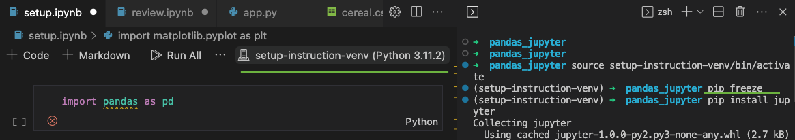

# Set up your data analysis environment

Learn to set up your Python environment to work with Jupyter Notebooks and pandas.

## Introduction

Up until now, you've been working in files that can be run sequentially, top down (procedurally). These files, mostly python files, have the ability to manipulate information and send and receive that information to other files, and parts of your program.

In this module, you'll be working slightly differently.

We will be using Jupyter Notebooks.

Jupyter Notebooks are more like an interactive document than a program file. They allow us to write pieces of python code that can be run individually in cells to achieve output. More on that in a moment.

Jupyter Notebooks are very popular in the Data world - they are a great way to input data, perform some analysis or calculations, and see the results in an accessible manner. 

As such, Jupyter Notebooks are a great way to interpret and display results quickly and effectively - and export nicely to business friendly mediums such as PDF.

Let's go ahead and set up Jupyter now.

## Setup

### 1. Virtual Environment
  Make a new folder for this module. Open it, make sure you are in the correct directory in the terminal.
  Set up your virtual environment to prepare for downloading the required libraries we will need in this module - where *data_venv_name* is the name of your virtual environment.

  It is a good idea to follow descriptive naming convention (much in the same way we name variables and functions) for you virtual environment. Calling it "project" or "venv" will confuse things down the line. A good typical rule is *project-version-"venv"*.
  
  ``` shell
  pwd
  /Users/<your-mac-name>/Folder/New_Folder_etc
  python3 -m venv data_venv_name # the name of your venv might differ!
  source data_venv_name/bin/activate # this will run the activate script in your virtual environment
  ```
  This will then execute the virtual environment and change how your terminal looks to show you have the venv open:
  ``` shell
  (data_venv_name) -> ls # lists files and folders
  # OUTPUTS ===>
  (data_venv_name) -> data_venv_name # we can see the venv folder - but we don't need to navigate inside or make files in it!
  ```
  
  *N.B You should see your venv folder when you use `ls`. We should never actually navigate inside our venv folder. Think of the venv folder like a safe or a lockbox. We should *NOT* be creating files inside the venv - we simply activate it and use `pip` to install our python libraries like Jupyter and Pandas to it.*

   - If in doubt, deactivate your venv with `deactivate` and delete the venv folder. You can always remake them, and this process promotes good venv hygiene.


### 2. Make a new Jupyter Notebook file

  Make sure you are in the correct directory, and **NOT** inside the venv folder itself.
  ``` shell
  (data_venv_name) -> pwd
  /Users/<your-name>/Documents/pandas_jupyter
  ```
  Now we'll make the Notebook and check we've made it in the right place - on the same level as the venv:
  ``` shell
  (data_venv_name) -> touch setup.ipynb
  (data_venv_name) -> ls
  data_venv_name setup.ipynb
  (data_venv_name) -> code setup.ipynb
  ```
   - *N.B. the extension is `.ipynb` as these were originally called Interactive Python Notebooks!*

### 3. Our first Jupyter cell

  We should see a blank cell in which we can type some Python.
  - *(You may be prompted to download Jupyter extensions immediately - hit YES.)*

  Go ahead and write a `print()` command with a greeting of *"Hello World"* and hit the `PLAY` triangle to the left of the cell.

  
  This should prompt VSCode to download the right kernels for running Jupyter.

  When you hit the play button you might be offered a choice to select a Python environment or a Jupyter server - choose **Python Environment** and select the one that has the same name as your virtual environment folder.

  Selecting the virtual environment will allow us to use the libraries in our notebook that we have installed inside our virtual environment.

  N.B. Jupyter Kernels can be tricky to get running in VSCode. IF you run into problems in this step try the following:
  - Uninstall Jupyter globally with pip.
      - Deactivate your venv with `deactivate`
      - Run `pip uninstall jupyter`
      - Try running the cell again.
  - Uninstall and reinstall `pyzmq`
      - `pip uninstall pyzmq`
      - `pip install pyzmq`
      - Try running the cell again.
  - Run Jupyter Notebook server from terminal.
      - In your terminal run `jupyter notebook`
      - This should open a Notebook in your browser.
      - Wait for it to connect to the kernel and try running a cell.


### 4. Running Multiple Cells

Now that we have run our first piece of Python inside a Jupyter Notebook, we can test it out and run some cells in sequence and out of sequence, in order to get a feel for how they work.

Take a look at the following snippet.


Notice that by hovering your cursor over the middle top edge, and middle bottom edge of any cell, you can add pieces of markdown above or below the python cells. Handy for contextualising the presentation of data.

Copy the `num = 15` cell and `FizzBuzz` example. Try and run the `if` block before the `num` block. What happens?


We have to have run the cell with the variable declaration in it before we use that variable again. If in doubt, hit the `Run All` button up top.


### 5. Importing Pandas and Matplotlib

We need to make sure we have the folder workspace open in VSCode, in order for VSCode to be able to recognise our virtual environment and select the correct kernel. If you are unsure, you can check by clicking the file explorer pane (the two sheets of paper icon ) on the top left - if you can see your venv folder and any files you have made, then you have the workspace open. If not, run the command `code .` in the correct directory that contains the virtual environment.

We can now download `pandas` and `matplotlib` to our virtual environment folder with our `pip` commands.

  ``` shell
  pip install pandas
  pip install matplotlib
  ```

Let's go ahead and import those and check they're working.

  ``` python
  import pandas as pd

  frame_one = pd.DataFrame()
  print(frame_one)
  ```

And for matplotlib, let's get a little bar chart going for fun:

  ``` python
  import matplotlib.pyplot as plt

  coffee_per_day = [1, 5, 8, 5, 4, 3, 2]
  days = ["Monday", "Tuesday", "Wednesday", "Thursday", "Friday", "Saturday", "Sunday"]

  plt.bar(days, coffee_per_day)
  plt.title("Coffees per day")
  plt.show()
  ```

If all has gone to plan you should have a Notebook that looks like this:


---

### Troubleshooting

If at this stage, or previously, you are getting errors saying that a module is not found, or that the `ipykernel` is missing, try the following steps:

1. Add the python version that is inside your virtual environment to the VSCode workspace:

  

  - By clicking on the Kernel button (default will say Python), you are able to choose the environment you have created.
  <br>
2. You can now check what libraries and modules we have installed in this virtual environment. Run the command `pip freeze` - if it returns nothing, the venv is empty!

  

  - If you return nothing from `pip freeze`, then install the required libraries to the virtual environment with `pip`.

  - Make sure you have activated the virtual environment with `source venv-folder-name/bin/activate`

  <br>

3. Upon creating the venv, you may be asked to download the required Jupyter extensions for VSCode (most likely if you didn't use `pip` to install Jupyter to the venv).

  

  - You can go ahead and click 'Install' on these - it simply downloads and installs much of the same packages as using `pip install Jupyter`. 
  <br>

4. If you are still struggling to connect to a Kernel, or find the correct environment, it is time to speak to a coach. It may be we need to specify the exact path to the Python version inside the virtual environment, or there may be permission issues we need to resolve - whatever it might be, if you have followed these steps, your coach will be able to unblock you.

---

### 6. Git Large File Storage

Finally, we need to install a program from GitHub that will allow us to clone repos that include large datasets, and large files.

In order to do this, we need to follow the steps outlined [on GitHub here](https://docs.github.com/en/repositories/working-with-files/managing-large-files/installing-git-large-file-storage) - or we can simply run the command 
`brew install git-lfs`

To ensure that the download has worked and Git LFS is working we can run the command 
`git lfs install` 
and see the returned message 
`Git LFS initialized.`

Refer to the Atlassian Guide in [this tutorial](https://www.atlassian.com/git/tutorials/git-lfs#:~:text=Once%20Git%20LFS%20is%20installed,be%20automatically%20downloaded%20for%20you) should you have any further queries about working with Git Large File Storage.

## Play with a Jupyter notebook

Take a few minutes to open [the "Test your data analysis setup" notebook](../notebooks/test_your_setup.ipynb) to test your setup and get a feel for how Jupyter Notebooks work.


[Next Challenge](02_your_first_analysis_question_bite.md)

<!-- BEGIN GENERATED SECTION DO NOT EDIT -->

---

**How was this resource?**  
[😫](https://airtable.com/shrUJ3t7KLMqVRFKR?prefill_Repository=makersacademy%2Fintro-to-data-analysis&prefill_File=pandas_bites%2F01_set_up_data_analysis_environment_bite.md&prefill_Sentiment=😫) [😕](https://airtable.com/shrUJ3t7KLMqVRFKR?prefill_Repository=makersacademy%2Fintro-to-data-analysis&prefill_File=pandas_bites%2F01_set_up_data_analysis_environment_bite.md&prefill_Sentiment=😕) [😐](https://airtable.com/shrUJ3t7KLMqVRFKR?prefill_Repository=makersacademy%2Fintro-to-data-analysis&prefill_File=pandas_bites%2F01_set_up_data_analysis_environment_bite.md&prefill_Sentiment=😐) [🙂](https://airtable.com/shrUJ3t7KLMqVRFKR?prefill_Repository=makersacademy%2Fintro-to-data-analysis&prefill_File=pandas_bites%2F01_set_up_data_analysis_environment_bite.md&prefill_Sentiment=🙂) [😀](https://airtable.com/shrUJ3t7KLMqVRFKR?prefill_Repository=makersacademy%2Fintro-to-data-analysis&prefill_File=pandas_bites%2F01_set_up_data_analysis_environment_bite.md&prefill_Sentiment=😀)  
Click an emoji to tell us.

<!-- END GENERATED SECTION DO NOT EDIT -->
