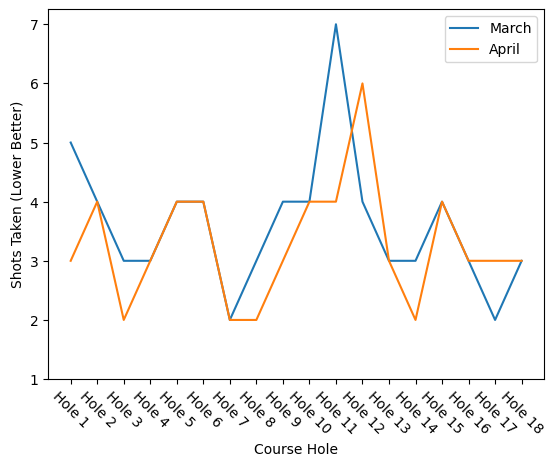

# Visualising data with pandas & matplotlib

_**This is a Makers Bite.** Bites are designed to train specific skills or
tools. They contain an intro, a demonstration video, some exercises with an
example solution video, and a challenge without a solution video for you to test
your learning. [Read more about how to use Makers
Bites.](https://github.com/makersacademy/course/blob/main/labels/bites.md)_


## Introduction

In this chapter we will begin to look at how to translate our categorical and numerical data points into something that can be more easily interpreted with visualisation. 

We have already seen some examples of how we can use some simple methods and handy python libraries to convert our data into graphs and plots, and now we are going to examine these libraries in more detail.

We will also be discussing which tools are the right ones to choose when it comes to visualisation. These are general guidelines, only. When it comes down to how to present your data, the determining factor is, as always, what question you are trying to answer.


#### *A Note on Data Types*

Throughout your journey exploring various elements of software and data engineering thus far, you will have encountered data types. In programming we need reference to the "types" of data in order to be able to manipulate them, and use them as information or state to suit our various aims, whether that be database management, web development or data exploration.

In Data Engineering, we need reference to further categories of data. Simply referring to data points as Strings, Integers and Booleans is not enough, we require further taxonomy.

That is where the **statistical data types** become helpful. Generally, we can break up tabular **statistical data types** into:


1. **Nominal Data**

1. **Ordinal Data**

1. **Numerical Data** (Discrete & Continuous)

For a much more detailed exploration of Statistical Data Types, and Exploratory Data Analysis in general, [please refer to this guide.](../pills/Exploratory_data_analysis.md) Or, visit the `pills/Exploratory_data_analysis.md` file manually.

>You may, once more, might want to make note of this file for future reference. For now, it is enough to simply read through and make mental note, as we will from hereon in be referring to data often as to its **statistical data type**. 

___

## Learning Objectives

By the end of this chapter you should be able to:

- create some basic plots
- decide on the best type of plot based on the type of data in a column
- describe what a plot is showing
- further transform data into manageable data types

#### *DALC - 04 DATA MODELLING.*
 - [Click here for more Data Analytics Life Cycle detail.](../pills/data_analytics_life_cycle.md#4---data-modeling)

___

## Matplotlib

Matplotlib is a handy open-source library that allows us to draw plots in many different forms. From bar histograms, to lines of best fit, to scatter plots and pie charts - you can make all of these with matplotlib, but the question of which one you should choose, we will come onto a little bit later.

We've already used this library a couple of times already in this module, but let's start with some simple examples of `matplotlib.pyplot` in action.

It is common to abbreviate `matlplotlib.pyplot` simply as `plt` so let's do so with an alias.

``` python
import matplotlib.pyplot as plt
# use plt as an alias 

plt.plot([1,2,3], [1,2,3])
# simple plot of two vectors, both exactly alike

plt.show()
# this will execute the plot in our notebooks
```

In this entirely made up example we have a perfect correlating line. This is quite unlikely in real data. You can plot more than one line, however.

``` python
plt.plot([1,2,3], [1,2,3])
# line one in blue

plt.plot([1,2,3], [1,3,5])
# line two in orange

plt.show()
```

<details>
  <summary>It should look like this:</summary>
  
  <p>Why? Because the "x" axis of both lines (the first array for both plots) is the same - [1, 2, 3].<br>
  But the second array, and therefore the "y" axis are different. Resulting in a similar "x" trajectory, but differing "y" trajectories.
  </p>
</details>

<br>

In the next example we will return to the Disc Golf Scores from an earlier chapter.

Disc Golf scores would be considered `Discrete` data.

<br>
<details>
  <summary>Given here:</summary>
  <p>Over 18 holes of disc golf in March, Amira, Steve and I have been keeping our scores</p>

  <code>
    march_dict_scorecard = {
    "Will" : [8, 4, 3, 3, 4, 4, 2, 3, 4, 4, 7, 4, 3, 3, 4, 3, 2, 3],
    "Amira" : [3, 2, 2, 3, 4, 7, 5, 3, 5, 2, 5, 2, 4, 5, 4, 3, 4, 3],
    "Steve" : [2, 4, 2, 4, 5, 3, 2, 5, 2, 5, 3, 5, 4, 4, 3, 2, 6, 3]
    }

  </code>

  <p>I want to load these scores into a Data Frame to see them better</p>

  <code>

    march_score_frame = pd.DataFrame(march_dict_scorecard, index=range(1, 19))

    march_score_frame
  </code>
</details>
<br>

Will wants to see whether his score has improves from March to April. Let's plot his scores against one another and see if there has been any improvement.

``` python
hole_comprehension = [f"Hole {i}" for i in range(1, 19)]
hole_index = pd.Index(hole_comprehension, name='Course Hole')
# A list comprehension to add the String "Hole" to each Course Hole Index


x = hole_index
y1 = march_score_frame['Will']
y2 = april_score_frame['Will']
# Two Y axes, the first is Will's score in March, the second is his score in April

plt.plot(x, y1, label="March")
plt.plot(x, y2, label="April")
# Two plots for each line

plt.xticks(rotation=-45)
plt.yticks(np.arange(1, 8, step=1))
# Some tidying so that the hole names don't overlap, and the score is in the right range

plt.xlabel("Course Hole")
plt.ylabel("Shots Taken (Lower Better)")
# Labelling the axes

plt.legend(loc="upper right")
# Adding a legend 

plt.show()
```
<details>
  <summary>It should look like this:</summary>
  
  
</details>

<br>
This makes it much easier for us to see that, yes, Will's score did improve between March and April.

We can use the same data, but plot it in a slightly different way to see whether all three players improved over the course of the month:

``` python
average_march = march_score_frame.sum()/18
average_april = april_score_frame.sum()/18

x = ["March", "April"]
y = [average_march, average_april]

# Two axes, x is the month, y is their average scores for March and April

plt.plot(x, y, label=["Will", "Amira", "Steve"])
# one plot for the line

plt.xticks(rotation=-45)
plt.yticks(np.arange(3, 4, step=0.25))
# Some tidying so that the hole names don't overlap, and the score is in the right range

plt.xlabel("Month")
plt.ylabel("Average Score")
# Labelling the axes

plt.legend(loc="upper right")
# Adding a legend 

plt.show()
```
<details>
  <summary>It should look like this:</summary>
  
  
</details>

<br>

Other charts and graphs we can use in matplotlib, such as pie charts and bar histograms are just as simple to create.

We can make a nice pie chart, by using some similar syntax, we simply use plt.pie() instead of plot().

Let's imagine we have taken a vote on favourite pie flavours.

Pie flavours would be considered `Nominal` data.

``` python
import matplotlib.pyplot as plt

# Favourite Types of Pie!

labels = ['Chocolate', 'Broccoli', 'Blueberries', 'Raspberries']
sizes = [9, 3, 7, 6] # Assuming 25 people voted
colors = ['brown', 'green', 'purple', 'pink']

plt.pie(sizes, labels=labels, colors=colors)
plt.title("Food Pie Chart")
plt.show()
```
<details>
  <summary>It should look like this:</summary>
  
  
</details>

<br>

We can then chart how many pies got eaten per day.

``` python
import matplotlib.pyplot as plt

pie_flavours = ['Chocolate', 'Broccoli', 'Blueberries', 'Raspberries']

sold_per_day_avg = [[3, 6, 4, 5], [3, 4, 8, 2]]

plt.bar(pie_flavours, sold_per_day_avg[0], label="Monday")
plt.bar(pie_flavours, sold_per_day_avg[1], width=0.6, label="Tuesday")
plt.title("Pies Sold Per Day")
plt.legend(loc="upper left" )
plt.show()
```
<details>
  <summary>It should look like this:</summary>
  
  
</details>

<br>

___

## Demonstration

*Coming soon*

[Demonstration Video](#demonstration)

## Exercise

Let's look at the World Happiness Data once again, and use it to plot some charts and infer some results.

Does the GDP data for the United Kingdom seem to have an influence on the overall standings in Happiness Rank?

What Statistical Data Types are `Happiness Rank` and `GDP per capita`? Explain in your notebook.

Chart the yearly Happiness Rank against the yearly GDP, and visualise your conclusion.

As a stretch goal, can you plot both the GDP axis and the Happiness axis on the same chart to show the similarities?
<details>
    <summary> This could be a potential solution</summary>
    <a href="./exercise_solutions/06_exercise_solution.ipynb">
    Exercise Example Solution</a>
</details>

## Challenge

Navigate to the Cereals dataset [here](../data/extra-challenge/cereals/cereal.csv) and import it into a DataFrame using Pandas.

Use Matplotlib - `import matplotlib.pyplot as plt` - in order to visualise your results.

Questions to answer:

  - Does the sugar content influence the calorie count? Visualise your conclusion.
  - Which are the top 4 cereals for vitamin content?Visualise your conclusion.
  - Which are the top 4 cereals for protein? Visualise your conclusion.
  - Does Sodium content positively or negatively affect overall ranking? Visualise your conclusion.

## Submitting Your Work

Use [this form](https://airtable.com/shr6mk28x0fy3OrxN?prefill_Item=data_eng_pd02) to submit your code and screen recording

## Up next

[Statistics Introduction.](../stats_bites01/bites/00_intro.md)

<!-- BEGIN GENERATED SECTION DO NOT EDIT -->

---

**How was this resource?**  
[😫](https://airtable.com/shrUJ3t7KLMqVRFKR?prefill_Repository=makersacademy%2Fintro-to-data-analysis&prefill_File=pandas_bites%2F06_visualise_data_with_pandas_bite.md&prefill_Sentiment=😫) [😕](https://airtable.com/shrUJ3t7KLMqVRFKR?prefill_Repository=makersacademy%2Fintro-to-data-analysis&prefill_File=pandas_bites%2F06_visualise_data_with_pandas_bite.md&prefill_Sentiment=😕) [😐](https://airtable.com/shrUJ3t7KLMqVRFKR?prefill_Repository=makersacademy%2Fintro-to-data-analysis&prefill_File=pandas_bites%2F06_visualise_data_with_pandas_bite.md&prefill_Sentiment=😐) [🙂](https://airtable.com/shrUJ3t7KLMqVRFKR?prefill_Repository=makersacademy%2Fintro-to-data-analysis&prefill_File=pandas_bites%2F06_visualise_data_with_pandas_bite.md&prefill_Sentiment=🙂) [😀](https://airtable.com/shrUJ3t7KLMqVRFKR?prefill_Repository=makersacademy%2Fintro-to-data-analysis&prefill_File=pandas_bites%2F06_visualise_data_with_pandas_bite.md&prefill_Sentiment=😀)  
Click an emoji to tell us.

<!-- END GENERATED SECTION DO NOT EDIT -->
