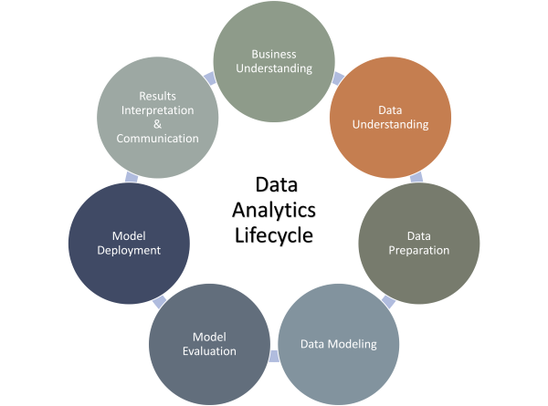
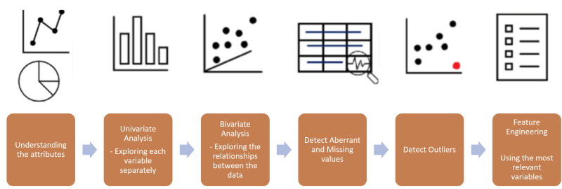
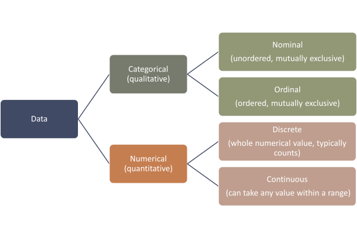

# Exploratory Data Analysis (EDA)
## Learning Outcomes
---
- Understand the key goals of Exploratory Data Analysis
- Describe the different steps of EDA
- Conduct a simple EDA for data from a CSV file using a Jupyter Notebook 

## Introduction
---
Exploratory Data Analysis (EDA) is a crucial stage in the data analytics life cycle.

Its primary objective is to gain a deep understanding of the available data. During EDA, data is visualised and transformed to uncover patterns, detect issues, and explore interesting aspects within the data. This process also helps identify the key questions that can be answered using the data.

It is essential to approach EDA without making assumptions about the data and to remain open to the possibilities of the insights that may emerge. Through EDA, statistical data types and key properties of the dataset are examined. This examination aids in comprehending the data and assessing its relevance to the specific question or problem being addressed.

Exploratory Data Analysis allows data scientists and analysts to thoroughly explore and familiarise themselves with the data, enabling them to make informed decisions about subsequent analysis or modeling. By uncovering hidden patterns, outliers, trends, and relationships within the data, EDA provides valuable insights that can drive further analysis and decision-making processes.

Embarking on Exploratory Data Analysis provides a solid foundation for understanding the data and its characteristics, enabling analysts and researchers to gain valuable insights and make informed decisions.

## Exploratory Data Analysis - Steps
---

### 1 - Understanding the Attributes
Begin by gaining a comprehensive understanding of the attributes or variables present in your dataset. Identify the types of variables (categorical, ordinal, numerical) and their respective meanings. This step ensures that you have a clear grasp of the data's structure and can guide subsequent analysis appropriately.

#### Types of Data

In exploratory data analysis (EDA), understanding the nature of the data in your dataset is a crucial initial step.\
In general data can be divided into the following data types:

When working with tabular data, it's important to consider three main **statistical data types**.

1. **Nominal Data**\
Nominal data represents categories or labels without any inherent order. Examples include spoken languages (English, Spanish, French, German, Mandarin), computer operating systems (Windows, Mac OS, Linux), or gender. Nominal data does not possess a quantitative value or rank.

1. **Ordinal Data**\
Ordinal data falls into ordered categories or ranks. Examples include clothing sizes (small, medium, large, extra-large), educational levels (GCSE, A-Levels, BSc, Master's, PhD), or Yelp ratings (ranging from zero to five stars). The categories have a relative order, but the numerical differences between them may not be uniform.

1. **Numerical Data**\
Numerical data consists of quantities or amounts. It includes measurable values such as height, weight, price, distance, or blood pressure. Numerical data can further be categorised as continuous (measured on a continuous scale) or discrete (countable and distinct values).

Identifying the statistical data types in your dataset helps inform the choices you make during further analysis. Each data type corresponds to specific operations that can be meaningfully performed on the data. For instance, computing the mean of salaries (numerical data) provides valuable insights into the average employee salary. However, calculating the mean of education levels (ordinal data) might not yield meaningful results. Instead, comparing values within the education level column provides valuable information regarding the relative rankings.

Additionally, understanding the data types helps determine which analyses are appropriate. For example, computing the mean of ID numbers (nominal data) does not offer meaningful insights, but recognizing that distinct ID numbers represent distinct employees provides important context.

By comprehending the statistical data types present in your dataset, you gain a better understanding of the analyses that can be performed, ensuring more informed decision-making throughout the exploratory data analysis process.

### 2 - Exploring Each Variable Separately (Univariate Analysis)
Perform univariate analysis to examine individual variables in isolation. For categorical variables, analyse the frequency distribution and visualise them using bar charts or pie charts. For numerical variables, assess summary statistics (mean, median, standard deviation) and explore their distribution through histograms or box plots. This step helps identify outliers, understand the central tendencies, and gain insights into the data distribution.

### 3 - Exploring Relationships Between the Data (Bi- or Multivariate Analysis)
After examining variables independently, explore relationships between pairs of variables through bivariate or multivariate analysis. Scatter plots, correlation matrices, or heatmaps can reveal patterns, associations, or dependencies between variables. This step helps uncover potential connections and guides further investigation.

### 4 - Detecting Aberrant and Missing Values in Data
Thoroughly examine the dataset for aberrant or missing values. Missing values can introduce biases and affect subsequent analyses. Identify missing values and determine appropriate strategies for handling them, such as imputation or deletion. Additionally, identify any erroneous or inconsistent values that may require correction.

### 5 - Detecting Outliers
Outliers are extreme values that deviate significantly from the majority of the data points. Use visualization techniques like box plots or scatter plots to identify potential outliers. Investigate the reasons behind their occurrence, assess their impact on analysis, and decide whether to remove or transform them based on domain knowledge and data characteristics.

### 6 - Using the Most Relevant Variables (Feature Engineering)
Based on the insights gained from the previous steps, perform feature engineering to select the most relevant variables for further analysis or modeling. Eliminate irrelevant or redundant variables that do not contribute significantly to the research question or analysis objectives. Consider techniques like feature selection, dimensionality reduction, or domain knowledge to refine the dataset.

### Exercise 
For this exercise, we are using 
- the Jupyter notebook [eda_exercise.ipynb](./notebooks/eda_exercise.ipynb) and
- the dataset [eda_exercise.csv](./datasets/eda_exercise.csv).

Start with the data exploration and familiarise yourself with the data.
- What information do you get from the data? 

<!-- BEGIN GENERATED SECTION DO NOT EDIT -->

---

**How was this resource?**  
[😫](https://airtable.com/shrUJ3t7KLMqVRFKR?prefill_Repository=makersacademy%2Fintro-to-data-analysis&prefill_File=pills%2FExploratory_data_analysis.md&prefill_Sentiment=😫) [😕](https://airtable.com/shrUJ3t7KLMqVRFKR?prefill_Repository=makersacademy%2Fintro-to-data-analysis&prefill_File=pills%2FExploratory_data_analysis.md&prefill_Sentiment=😕) [😐](https://airtable.com/shrUJ3t7KLMqVRFKR?prefill_Repository=makersacademy%2Fintro-to-data-analysis&prefill_File=pills%2FExploratory_data_analysis.md&prefill_Sentiment=😐) [🙂](https://airtable.com/shrUJ3t7KLMqVRFKR?prefill_Repository=makersacademy%2Fintro-to-data-analysis&prefill_File=pills%2FExploratory_data_analysis.md&prefill_Sentiment=🙂) [😀](https://airtable.com/shrUJ3t7KLMqVRFKR?prefill_Repository=makersacademy%2Fintro-to-data-analysis&prefill_File=pills%2FExploratory_data_analysis.md&prefill_Sentiment=😀)  
Click an emoji to tell us.

<!-- END GENERATED SECTION DO NOT EDIT -->
