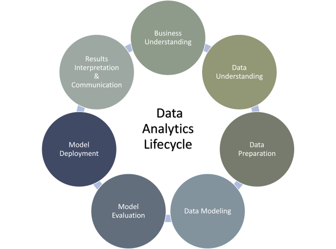

# The Data Analytics Lifecycle
## Learning Objectives
---
- Understand the need for a process in Data Analytics.
- Describe the different stages of the Lifecycle and their steps.
- Able to follow these steps in a Data Analytics project.

<!-- OMITTED -->

## Introduction
---
When you are getting involved in a Data Analytics project, it is easy to get lost in the data. A well-defined process can help to guide any analytical project by break large projects into smaller pieces
The data analytics lifecycle is a framework for guiding the process of deriving insights and value from data. It outlines the stages involved in extracting, processing, and analysing data to support decision-making and drive business outcomes. The data analytics lifecycle typically consists of the following stages:

1. **Business understanding**
This stage involves identifying the business problem, goal, or opportunity that data analytics can help address. It includes understanding the context, defining objectives, and determining the key performance indicators (KPIs) that will be used to measure success.
1. **Data understanding**
This stage involves gathering and exploring the data to understand its structure, quality, and relevance to the business problem. This may include data profiling, descriptive statistics, and data visualisation to identify patterns and relationships.
1. **Data preparation**
In this stage, the data is cleaned, transformed, and enriched to improve its quality and make it suitable for analysis. This may involve handling missing values, outliers, or inconsistencies, as well as integrating data from multiple sources and transforming variables to ensure compatibility.
1. **Data modeling**
This stage involves selecting appropriate analytical techniques and building models to analyse the data. The choice of techniques depends on the problem and the data. Examples include regression analysis, clustering, classification, or time-series analysis. The model building typically involves feature selection, training, and validation to ensure that the model is accurate and generalisable.
1. **Model evaluation**
Once the models are built, they are evaluated for their performance, accuracy, and relevance to the business problem. This stage involves comparing different models, selecting the best one(s), and fine-tuning the model parameters to optimise performance.
1. **Model deployment**
After selecting the best model, it is deployed into a production environment to generate insights and predictions. This stage involves integrating the model into existing systems, processes, and workflows, as well as monitoring and maintaining the model to ensure its ongoing effectiveness.
1. **Results interpretation and communication**
The final stage of the data analytics lifecycle involves interpreting the results generated by the model, drawing conclusions, and communicating the insights to relevant stakeholders. This may involve creating visualisations, dashboards, or reports to convey the findings effectively and providing recommendations for action based on the insights.

Throughout the data analytics lifecycle, it is crucial to have a strong collaboration between domain experts, data analysts, and business stakeholders to ensure the analytics project aligns with business goals and delivers meaningful insights.

## 1 - Business Understanding
---
The business understanding phase is the first step in the data analytics lifecycle. It involves gaining a clear understanding of the organization's objectives, goals, and challenges, as well as identifying opportunities where data analytics can provide value.

During this phase, it is crucial to engage with stakeholders, such as business managers, executives, and subject matter experts, to gather their insights and perspectives. The main objectives of the business understanding phase are as follows:

1. **Define business objectives**\
Clearly articulate the organisation's goals and objectives. This may include improving operational efficiency, increasing customer satisfaction, reducing costs, or optimising marketing campaigns, among others.

1. **Identify business questions**\
Collaborate with stakeholders to identify the key questions and challenges that need to be addressed to achieve the defined objectives. These questions should be specific, measurable, achievable, relevant, and time-bound (SMART).

1. **Determine data requirements**\
Understand the data needed to answer the identified business questions. This includes identifying the sources of data, the required data quality, and any data limitations or constraints.

1. **Assess data availability**\
Evaluate the availability and accessibility of relevant data. Determine whether the required data is already available within the organisation or if additional data collection or integration efforts are necessary.

1. **Identify success criteria**\
Define the criteria that will be used to evaluate the success of the data analysis project. This could be based on key performance indicators (KPIs) or specific metrics aligned with the business objectives.

1. **Define project scope**\
Clearly define the boundaries and limitations of the data analysis project. Determine what will be included and excluded, as well as any assumptions or constraints that need to be considered.

1. **Risk assessment**\
Identify potential risks and challenges associated with the project, such as data privacy concerns, technical limitations, or resource constraints. Assess the feasibility and potential impact of these risks on the project's success.

1. **Create a project plan**\
Develop a high-level plan outlining the key activities, timelines, and resource requirements for the data analysis project. This plan should consider the priorities, constraints, and available resources within the organisation.

By thoroughly understanding the business context and requirements in the initial stage, organisations can set a strong foundation for their data analysis initiatives. This phase sets the stage for subsequent stages in the data analysis lifecycle, such as data preparation, data modelling, and interpretation of results.

## 2 - Data understanding
---
The data understanding phase, also known as data analysis, is a critical step in the data analytics lifecycle. This phase involves comprehensively exploring and acquiring an in-depth understanding of the available data that will be used for analysis.

Here are the steps involved in the data understanding phase:

1. **Data Identification**\
Identify the relevant data sources and determine the types of data available. This may include structured data from databases, unstructured data from documents or text, or semi-structured data from sources like XML or JSON files.

1. **Data Collection**\
Gather the identified data from various sources, ensuring proper data acquisition methods and adherence to data privacy regulations. This may involve extracting data from databases, accessing data from APIs, or acquiring data through other means.

1. **Data Description**\
Examine the collected data and document its characteristics, including the format, structure, and size. Record details about the variables, attributes, and relationships within the dataset.

1. **Data Quality Assessment**\
Assess the quality of the data to identify any potential issues or anomalies. This includes checking for missing values, inconsistencies, duplicates, or outliers that may impact the analysis.

1. **Data Exploration**\
Conduct exploratory data analysis techniques to gain insights into the data. This may involve examining summary statistics, visualizations, or applying statistical methods to identify patterns, trends, or relationships within the data.

1. **Data Verification**\
Verify the accuracy and reliability of the data by cross-referencing it with known information or subject matter experts. This step helps ensure the data's validity and authenticity.

1. **Initial Data Transformation**\
Perform basic data transformations, such as filtering, cleaning, or formatting, to prepare the data for further analysis. This may include removing unnecessary columns, handling missing values, or standardizing data formats.

1. **Data Integration**\
Integrate and combine multiple datasets if necessary. This step involves merging data from different sources or linking datasets based on common attributes to create a comprehensive dataset for analysis.

1. **Data Subset Selection**\
Select a representative subset of data from the entire dataset for detailed analysis. This subset should capture the relevant information and provide a manageable size for efficient analysis.

1. **Data Description Documentation**\
Document the findings from the data understanding phase, including the data's characteristics, quality, and initial observations. This documentation serves as a reference for future stages in the data analytics lifecycle.

## 3 - Data preparation
---
Here are the steps involved in the data preparation phase:

1. **Data Cleaning**\
Identify and handle any inconsistencies, errors, or outliers in the data. This may include removing duplicate records, correcting data entry mistakes, and addressing any formatting issues.

1. **Handling Missing Data**\
Deal with missing values in the dataset. This could involve imputing missing values using statistical techniques, removing records with excessive missing data, or considering domain knowledge to fill in missing information.

1. **Data Transformation**\
Transform the data into a suitable format for analysis. This may include converting data types, scaling numeric values, or encoding categorical variables.

1. **Feature Engineering**\
Create new derived features from existing ones to enhance the predictive power of the dataset. This could involve combining or aggregating variables, extracting meaningful information, or creating interaction terms.

1. **Data Integration**\
Combine data from multiple sources or datasets. This process involves merging datasets based on common attributes or keys to create a unified and comprehensive dataset for analysis.

1. **Data Reduction**\
Reduce the dimensionality of the dataset while preserving relevant information. Techniques like feature selection or dimensionality reduction methods such as Principal Component Analysis (PCA) can be used to achieve this.

1. **Data Sampling**\
If the dataset is large, consider taking a representative sample for analysis. Sampling helps reduce computational requirements and allows for quicker analysis without sacrificing the integrity of the results.

1. **Data Splitting**\
Divide the dataset into training, validation, and testing sets. The training set is used to build and train the predictive models, the validation set is used for model selection and hyperparameter tuning, and the testing set is used to evaluate the final model's performance.

1. **Data Formatting**\
Ensure consistent formatting and standardization across the dataset. This includes aligning units of measurement, date formats, and applying any necessary data transformations for compatibility.

1. **Data Quality Assurance**\
Perform a final check on the prepared dataset to ensure its quality and readiness for analysis. This may involve validating against defined quality criteria, addressing any remaining issues, and documenting the final dataset's characteristics.

By diligently preparing the data in this phase, data analysts can ensure the dataset is clean, structured, and suitable for analysis,

## 4 - Data modeling
---
Data modeling is a crucial phase in the data analytics lifecycle, where the prepared data is transformed into a structured format that facilitates analysis and enables the creation of predictive or descriptive models. This phase involves selecting appropriate modeling techniques, creating a model schema, and applying algorithms to generate insights and predictions from the data.

Here are the steps involved in the data modeling phase:

1. **Model Selection**\
Identify and select the appropriate modeling techniques based on the objectives of the analysis. This could include statistical models, machine learning algorithms, regression models, decision trees, or neural networks, among others.

1. **Variable Selection**\
Determine which variables from the prepared dataset will be included in the model. This involves assessing the relevance, predictive power, and potential interactions among variables to create a model that captures the essential information.

1. **Model Schema Design**\
Design the structure and components of the chosen model. This includes defining the input variables, output variables, and the relationships or dependencies among them. It may also involve specifying the algorithmic approach and model parameters.

1. **Model Training**\
Use the prepared dataset to train the selected model. This involves fitting the model to the data, estimating the model parameters, and optimizing the model's performance on the training data.

## 5 - Model evaluation
---
Model evaluation is another crucial phase in the data analytics lifecycle, where the performance and effectiveness of the developed model are assessed. This phase involves measuring the model's accuracy, reliability, and generalization capabilities to determine its suitability for solving the defined business problem.

Here are the steps involved in the model evaluation phase:

1. **Model Evaluation**\
Assess the performance and accuracy of the trained model. This includes evaluating metrics such as accuracy, precision, recall, or area under the curve (AUC) to determine how well the model predicts or describes the data.

1. **Model Validation**\
Validate the trained model on independent datasets or through cross-validation techniques. This step helps ensure that the model's performance is consistent and not overly dependent on the specific training data.

1. **Model Optimisation**\
Fine-tune the model by adjusting its parameters or exploring different variations of the selected algorithm to improve its performance. This iterative process aims to enhance the model's predictive power, generalization capabilities, or interpretability.

## 6 - Model deployment
---
1. **Model Deployment**\
Prepare the model for deployment in a production environment or for further analysis. This involves packaging the model into a format suitable for deployment, such as creating APIs, exporting model artifacts, or integrating it with other software systems.

1. **Documentation**\
Document the modeling process, including the chosen model, its parameters, evaluation results, and any assumptions or limitations. This documentation serves as a reference for future analyses, model maintenance, or further model development.

## 7 - Results interpretation and communication
---
The results interpretation and communication phase is a critical step in the data analytics lifecycle. In this phase, the insights and findings derived from the data analysis are interpreted, translated into meaningful information, and effectively communicated to stakeholders.

Here are the steps involved in the results interpretation and communication phase:

1. **Interpretation of Results**\
Analyse the outputs of the data analytics process, including the model predictions, patterns, or relationships discovered. Interpret the results in the context of the business problem and objectives defined in earlier stages of the data analytics lifecycle.

1. **Contextualisation**\
Relate the obtained results to the specific business domain, industry, or operational context. Understand the implications of the findings and how they can impact decision-making or drive actionable outcomes.

1. **Validation and Verification**\
Verify the reliability and validity of the results by cross-referencing them with domain expertise, historical knowledge, or external benchmarks. Ensure that the interpretations are accurate and supported by evidence.

1. **Simplification and Summarisation**
\Distill the complex analytical outputs into simplified and easily understandable messages. Summarise the key insights, trends, or predictions in a concise and meaningful manner, avoiding jargon or technical complexities.

1. **Visualisation**\
Utilise data visualisation techniques to represent the findings visually. Create clear and engaging visualisations such as charts, graphs, or infographics that effectively convey the information and aid in comprehension.

1. **Storytelling**\
Craft a compelling narrative around the results to make them more relatable and impactful. Develop a coherent story that links the data-driven insights to the business context, highlighting the relevance and potential implications of the findings.

1. **Stakeholder Communication**\
Tailor the communication of results to the intended audience. Adapt the language, level of technical detail, and format to suit the stakeholders' backgrounds and preferences. Present the findings in meetings, reports, presentations, or interactive dashboards as appropriate.

1. **Actionable Recommendations**\
Provide actionable recommendations based on the interpreted results. Clearly articulate the steps or decisions that can be taken based on the insights gained from the data analysis. Ensure that the recommendations are practical, feasible, and aligned with the defined business objectives.

1. **Feedback Incorporation**\
Encourage feedback from stakeholders and incorporate their input into the interpretation and communication process. Engage in discussions, address questions, and refine the message to ensure clarity and mutual understanding.

1. **Documentation**\
Document the interpretation, communication, and feedback received for future reference. Capture the insights, recommendations, visualisations, and any supporting information to maintain a record of the data analysis process and its outcomes.

<!-- BEGIN GENERATED SECTION DO NOT EDIT -->

---

**How was this resource?**  
[😫](https://airtable.com/shrUJ3t7KLMqVRFKR?prefill_Repository=makersacademy%2Fintro-to-data-analysis&prefill_File=pills%2Fdata_analytics_life_cycle.md&prefill_Sentiment=😫) [😕](https://airtable.com/shrUJ3t7KLMqVRFKR?prefill_Repository=makersacademy%2Fintro-to-data-analysis&prefill_File=pills%2Fdata_analytics_life_cycle.md&prefill_Sentiment=😕) [😐](https://airtable.com/shrUJ3t7KLMqVRFKR?prefill_Repository=makersacademy%2Fintro-to-data-analysis&prefill_File=pills%2Fdata_analytics_life_cycle.md&prefill_Sentiment=😐) [🙂](https://airtable.com/shrUJ3t7KLMqVRFKR?prefill_Repository=makersacademy%2Fintro-to-data-analysis&prefill_File=pills%2Fdata_analytics_life_cycle.md&prefill_Sentiment=🙂) [😀](https://airtable.com/shrUJ3t7KLMqVRFKR?prefill_Repository=makersacademy%2Fintro-to-data-analysis&prefill_File=pills%2Fdata_analytics_life_cycle.md&prefill_Sentiment=😀)  
Click an emoji to tell us.

<!-- END GENERATED SECTION DO NOT EDIT -->
