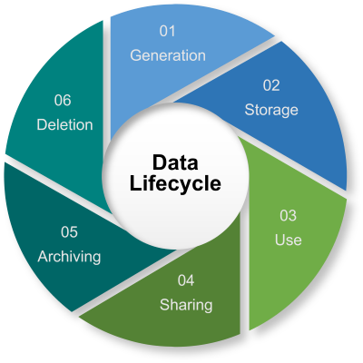

# Data Life Cycle
## Learning Outcomes
---
- Explain the concept of the data life cycle and its role in effective data management.
- Recognise the various stages of the data life cycle and describe the key activities carried out at each stage.
- Critical analyse real-world examples of the data life cycle, identifying challenges and opportunities throughout the data life cycle stages.

## Introduction
---
When you work with data as a data engineer and a data analyst, you will come across different life cycles, like 
- The data life cycle,
- the data analytics life cycle and
- The data engineering life cycle

## The Data Lifecycle 
---

The data life cycle is a series of stages that data goes through from its creation to its eventual retirement or disposal. It represents the entire journey of data, as it is collected, processed, analysed, stored, shared, and finally archived or deleted. Understanding the data life cycle helps organisations manage their data effectively and ensures that data is used responsibly and securely. The data life cycle typically consists of the following stages:

1. **Data generation and collection**
This stage involves the creation or acquisition of data from various sources. These could be machine-generated (e.g. by sensors or software) or human-generated (e.g. by user input).
The data is collected and aggregated from the sources. This stage may involve data cleansing and preprocessing to ensure the quality and consistency of the data.
1. **Data storage**\
The collected data is stored in databases, data warehouses, or other storage systems for easy access and retrieval. Proper data storage ensures data security, integrity, and availability.
1. **Data use**\
Data is processed using various techniques and tools to extract meaningful insights. This stage may involve data transformation, normalisation, or aggregation.
The processed data is analysed using various methods, such as statistical analysis, machine learning, or data mining, to uncover patterns, trends, and relationships that provide valuable insights.
The results of data analysis are presented in a visually appealing and understandable format, such as graphs, charts, or reports. This helps decision-makers to easily interpret the insights and make informed decisions.
1. **Data sharing**\
The data and its associated insights may be shared with relevant stakeholders, both internally and externally, in a secure and compliant manner.
1. **Data archiving**\
Data archiving is the process of securely storing data that is no longer actively used but needs to be retained for long-term preservation, regulatory compliance, or other legal purposes. 
1. **Data deletion**\
The data life cycle concludes with disposing of data that is no longer needed. Data deletion is the process of permanently erasing data from a storage device or system, making it irretrievable and unrecoverable. It is performed when data is no longer needed or when it needs to be securely and permanently erased to protect sensitive information from unauthorised access. 

Reflective exercises
---
- Describe a real-life example of a data life cycle in an organisation you are familiar with. Identify the stages involved and the activities performed at each stage.
- Consider a situation where you had to share data with other stakeholders. How did you ensure the data was shared securely and compliantly? What challenges did you face during this process?
- Discuss the importance of data archiving and deletion in ensuring data security and regulatory compliance. 

<!-- BEGIN GENERATED SECTION DO NOT EDIT -->

---

**How was this resource?**  
[😫](https://airtable.com/shrUJ3t7KLMqVRFKR?prefill_Repository=makersacademy%2Fintro-to-data-analysis&prefill_File=pills%2Fdata_life_cycle.md&prefill_Sentiment=😫) [😕](https://airtable.com/shrUJ3t7KLMqVRFKR?prefill_Repository=makersacademy%2Fintro-to-data-analysis&prefill_File=pills%2Fdata_life_cycle.md&prefill_Sentiment=😕) [😐](https://airtable.com/shrUJ3t7KLMqVRFKR?prefill_Repository=makersacademy%2Fintro-to-data-analysis&prefill_File=pills%2Fdata_life_cycle.md&prefill_Sentiment=😐) [🙂](https://airtable.com/shrUJ3t7KLMqVRFKR?prefill_Repository=makersacademy%2Fintro-to-data-analysis&prefill_File=pills%2Fdata_life_cycle.md&prefill_Sentiment=🙂) [😀](https://airtable.com/shrUJ3t7KLMqVRFKR?prefill_Repository=makersacademy%2Fintro-to-data-analysis&prefill_File=pills%2Fdata_life_cycle.md&prefill_Sentiment=😀)  
Click an emoji to tell us.

<!-- END GENERATED SECTION DO NOT EDIT -->
