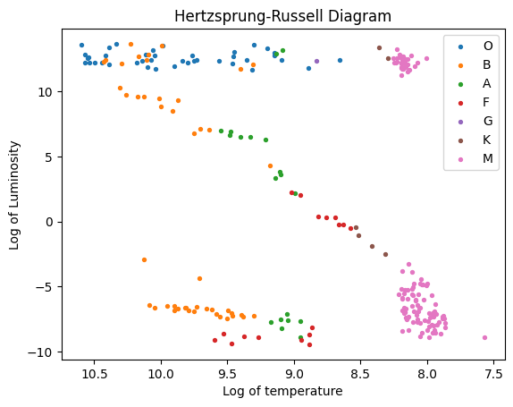

# Descriptive Statistics

_**This is a Makers Bite.** Bites are designed to train specific skills or
tools. They contain an intro, a demonstration video, some exercises with an
example solution video, and a challenge without a solution video for you to test
your learning. [Read more about how to use Makers
Bites.](https://github.com/makersacademy/course/blob/main/labels/bites.md)_

## Learning 

By the end of this chapter, you should be able to:

- Explain what we mean by descriptive statistics
- Demonstrate what the Range of a sequence or list
- Start to describe some data

___

## Introduction

A statistic is a measure that says something about the data we are looking at. The `mean` appeared in the investigations of the previous chapter. The 'shape' of the data was also mentioned. But having more than one of these measures doesn't make `descriptive statistics`, which is the process of analysing data in order to summarise what we know about the **_sample_** rather than to reach conclusions about the **_population_**.

 #### *DALC - 02 DATA UNDERSTANDING.*
 - [Click here for more Data Analytics Life Cycle detail.](../../pills/data_analytics_life_cycle.md#2---data-understanding)

___

## Range

You might remember from school, when you would be given a long list of numbers and asked a question about them. For instance:

```
These are the ages of some apprentices who are learning how to code. What is the range of their ages?

28, 35, 41, 55, 26, 19, 37, 45, 35, 27
```

<details>
<summary>Reveal answer</summary>

The `range` is a measure of how spread out the data is. We can calculate it by doing: `highest - lowest`

So the range is

```
55 - 19 = 36
```
</details>

## Exercise

Find the range in temperature of all the stars in our mini-catalogue. `Pandas` and `numpy` can make this easier for you.

<details>
<summary>Reveal suggest answer</summary>

```python
import pandas as pd
import numpy as np

stars = pd.read_csv("../../data/smaller-datasets/Stars.csv")
temperatures = stars.Temperature
max_temp = np.max(temperatures)
min_temp = np.min(temperatures)
print(max_temp - min_temp)
# 38061
```

As an extra challenge: try to find the range for each colour of star.

</details>

## More complex data
In the real world, we will probably be interested in more than just the ages of the apprentices. As a company, `Makers` prides itself on being inclusive and providing opportunity to under-represented groups. We'd probably list things like: previous educational achievement, location, race, gender, sexuality and many more. 

As you have seen in the `Stars` data collection, we can gather a lot of data on each element of our sample. Seeing it all in a table makes it difficult to notice any patterns. We could find ways to summarise each column (like we did by finding the range of temperatures). In fact: the next chapter looks at some of other ways of doing that.

___

## Exercise
Make a `frequency table` to show how many stars of each colour there are in the `Stars.csv` collection we previously looked at. Sort the results so the most common colour is at the top.

The first few lines should look like this (The column on the left is the index before sorting):


|  |   Color	 |  frequency |
|---|-----|----|
| 8	| Red | 112
| 0	| Blue | 56
| 4	| Blue-white | 41


<details>
<summary>Reveal suggested answer</summary>

```python
import pandas as pd
import numpy as np

stars = pd.read_csv("../../data/smaller-datasets/Stars.csv")

stars.groupby("Color").size().reset_index(name="frequency").sort_values(by="frequency", ascending=False)
```

Of course there are other ways to do this.
</details>

___

## Looking for connections between columns

So far, our summaries have been about one column at a time: the range of temperatures and the frequency of each colour. 

But there is another question to ask. Are the values in two columns totally independent of each other? For instance: 
- Does the colour of a star have any connection to its temperature? 
- Are hotter stars more luminous? 

Astronomers have already made this kind of investigation, resulting in a famous diagram: the [Hertzsprung-Russel diagram](https://en.wikipedia.org/wiki/Hertzsprung%E2%80%93Russell_diagram). Our data doesn't have the colour-index used as one of the axes. But we can get quite close:



This kind of graph is called a scatter graph. Each star in our collection is plotted according to the `log` of its temperature and luminosity. This groups stars in certain places and reveals a line from hot, bright stars to cooler, dimmer stars. This line is called the `main sequence` and has influenced astronomers' understanding of how stars develop. (If you want to know more about what using `logarithms` of our data does, then take a look at this study on [planetary orbits](../notebooks/02_planetary_orbits.ipynb))

___

## Exercise
Investigate our collection by making alternative scatter graphs of the data. Use [this notebook](../notebooks/02_describe_the_stars.ipynb) to help you. None of the options in that notebook will give you the colour coding in the diagram above. But you can get a blue and white version of it. What other relationships can you find?

___

## Challenge
A challenge for you to do. These are designed to help you challenge your learning. They don't have example solutions but you can check in with a coach if you are stuck or unsure.

Try to recreate the colour coded version of the scatter graph. 

Hint: You will need to plot the data for each spectral class separately.

## Submitting Your Work

**No need to submit just yet, retain this notebook and your visualisation for use in the future challenges.**

## Summary
We have summarised our `stars` data collection, using concepts like `range` and `frequency table`. We also described a connection between temperature and luminosity by using a `scatter graph`. We noted, but didn't justify, that such a diagram was an important aid in understanding stars.


[Next Challenge](03_CalculatingMeanMedianAndMode.md)

<!-- BEGIN GENERATED SECTION DO NOT EDIT -->

---

**How was this resource?**  
[😫](https://airtable.com/shrUJ3t7KLMqVRFKR?prefill_Repository=makersacademy%2Fintro-to-data-analysis&prefill_File=stats_bites01%2Fbites%2F02_DescriptiveStatistics.md&prefill_Sentiment=😫) [😕](https://airtable.com/shrUJ3t7KLMqVRFKR?prefill_Repository=makersacademy%2Fintro-to-data-analysis&prefill_File=stats_bites01%2Fbites%2F02_DescriptiveStatistics.md&prefill_Sentiment=😕) [😐](https://airtable.com/shrUJ3t7KLMqVRFKR?prefill_Repository=makersacademy%2Fintro-to-data-analysis&prefill_File=stats_bites01%2Fbites%2F02_DescriptiveStatistics.md&prefill_Sentiment=😐) [🙂](https://airtable.com/shrUJ3t7KLMqVRFKR?prefill_Repository=makersacademy%2Fintro-to-data-analysis&prefill_File=stats_bites01%2Fbites%2F02_DescriptiveStatistics.md&prefill_Sentiment=🙂) [😀](https://airtable.com/shrUJ3t7KLMqVRFKR?prefill_Repository=makersacademy%2Fintro-to-data-analysis&prefill_File=stats_bites01%2Fbites%2F02_DescriptiveStatistics.md&prefill_Sentiment=😀)  
Click an emoji to tell us.

<!-- END GENERATED SECTION DO NOT EDIT -->
