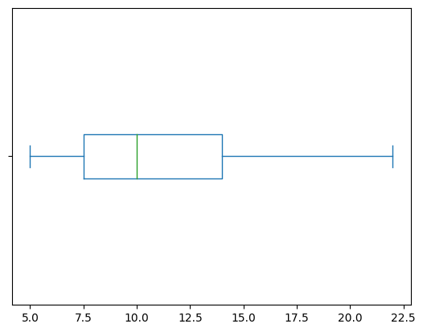
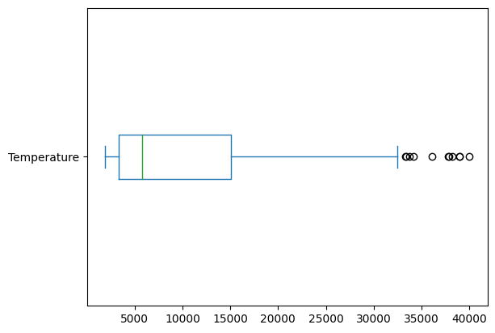

# Percentiles

_**This is a Makers Bite.** Bites are designed to train specific skills or
tools. They contain an intro, a demonstration video, some exercises with an
example solution video, and a challenge without a solution video for you to test
your learning. [Read more about how to use Makers
Bites.](https://github.com/makersacademy/course/blob/main/labels/bites.md)_

## Learning Objectives

- Calculate a `percentile` of a list of numbers
- Calculate `quartiles` and `inter-quartile` range
- Explain what an `outlier` is in a more formal way

## Introduction

We have recently looked at the `median`, which was a value that split a list of numbers into two halves. The aim was that half of those numbers are above the median and half below. 

We can generalise this. We can split the numbers into three parts so that each part has an equal number of elements. Splitting into four parts is more common, and to do that we need to find three values to split our numbers. We call these the `quartiles`. 

Collectively: these kinds of values, which split a list of numbers into equal sized parts, are called `quantiles`. The `2-quantile` is the `median`, the `4-quantiles` are the quartiles. An important group are the `100-quantiles`, which are called `percentiles`. 

 #### *DALC - 02 DATA UNDERSTANDING.*
 - [Click here for more Data Analytics Life Cycle detail.](../../pills/data_analytics_life_cycle.md#2---data-understanding)

___

## Finding the median as a percentile

`Pandas` has a method which will find `percentiles` for us. The method is called `quantile`, and it can be used to work out `quantiles` in general. 

We want to work out the `median`, which is the `2-quantile`. We are dividing our list into `2` parts and want a value which can act as the "dividing line" -- small values to one side and the same number of large values on the other side. Since we are "cutting" the list into two halves, we can use the value `1/2` as the argument.

To do that with `pandas`, we use the following code:

```python
import pandas as pd
nums = pd.Series([5, 6, 8, 9, 11, 13, 17, 22])

nums.quantile(1/2)
```

We should know from the previous chapter that the answer is `10`. That's what we get (but as a real number rather than an integer, since that is how the method is programmed).

Most people would convert the fraction `1/2` into a decimal. And recognise that it is `50%`, so the median is also a `percentile`.

## Finding the quartiles

We actually need to find three values to find the quartiles. We are cutting our list of numbers into four parts, so the three dividing lines will be `1/4`, `2/4` and `3/4` of the way through the list. The first and last of these are called the `lower` and `upper` `quartiles`.

We can find all three `quartiles` at once.

## Exercise

``` python
import pandas as pd
nums = pd.Series([5, 6, 8, 9, 11, 13, 17, 22])

```

Pass an array of the given fractions as an argument to the quantile method given above. You can do that in this [notebook](../notebooks/04_percentiles.ipynb)

<details>
<summary>Reveal suggested answer</summary>

The below code will work:

```python
import pandas as pd
nums = pd.Series([5, 6, 8, 9, 11, 13, 17, 22])

# you could have used decimals or equivalent fractions
nums.quantile([1/4, 2/4, 3/4])
```

And the output should have been a table, with the list we used as an argument in one column (as decimals). The other column is the values of each `quartile`. Notice that the second `quartile` is also the `median`. That shouldn't surprise us since `2/4` = `1/2`

```python
0.25     7.5
0.50    10.0
0.75    14.0
```
</details>

## Some problems you may notice

We have a way of working out the `median` by hand. And it's natural to suppose that this method is robust and can be extended to `quartiles` -- especially if you have come across `quartiles` in GCSE maths. But in that case: why is the first quartile closer to `8` than it is to `6`? We can ask `pandas` to calculate `quartiles` in a different way and, in this case, it gives the midpoint of `6` and `8`.

```python
import pandas as pd
nums = pd.Series([5, 6, 8, 9, 11, 13, 17, 22])

nums.quantile([1/4, 0.5, .75], interpolation="midpoint")
# gives the response
0.25     7.0
0.50    10.0
0.75    15.0
```

You might still find some differences to the GCSE method if you try other lists of numbers. GCSE aims to introduce people to these ideas in an intuitive way. At this stage, it is enough to note the difference.

The formula `pandas` is using can be found on [wikipedia](https://en.wikipedia.org/wiki/Percentile). You don't need to know the details. But a run through is given below.

<details>
<summary>Optional run through of how pandas finds the first quartile</summary>

The basic idea is that, after ordering the numbers, we give them a rank by counting them. Then we want to calculate the rank of the `quartile`.

We have eight numbers (N), ranked `1` to `8`. The formula to find a `quantile` needs a fraction, and it is the same fraction we have been using with the `pandas` `Series.quantile()` method.

```python
# The general formula is
fraction * (N - 1) + 1
```

To find the first `quartile`, we replace that fraction with `1/4` -- just as would pass that fraction as an argument to `.quantile()`.

And `7/4 + 1 = 2.75`. So we want the number with rank `2.75`. This number is not in our list. It's value would be closer to the third number rather than the second. 

To find the number `3/4` of the way from `6` to `8`, we take `3/4` of the interval and add it on to `6`. 

The interval is `8 - 6 = 2`, three quarters of that is `1.5` so the first quartile is `6 + 1.5 = 7.5` 
</details>

## Inter-quartile range

In an earlier chapter, we worked out the `range` of a list of numbers. This can be a valuable piece of information, but it can be changed quite a bit by an `outlier`. When we compared the `mean` to the `median`, we noted that the median was less influenced by outliers. The quartiles are also quite resistant to outliers. For this reason, statisticians have chosen to consider the `inter-quartile range` as an alternative to the simple `range`. The inter-quartile range is computed as the difference between the upper and lower quartiles.

## Exercise

``` python
import pandas as pd
nums = pd.Series([5, 6, 8, 9, 11, 13, 17, 22])
```

Calculate the `inter-quartile range` of the numbers above. (Use the values we got first, given by the default setting of `pandas`).

<details>
<summary>Reveal suggested answer</summary>

``` python
lower_quartile = nums.quantile(1/4)
upper_quartile = nums.quantile(3/4)

inter_quartile_range = upper_quartile - lower_quartile

print(inter_quartile_range)

(output) => 6.5
```

The lower quartile was `7.5` and the upper quartile was `14`

`14 - 7.5 = 6.5`, so the `inter-quartile range` is `6.5`
</details>

## Box-plots

We now have quite a few numbers to describe our list. `Box-plots` are a way to display that data. Add this line to the code in the [notebook we were using previously](../notebooks/04_percentiles.ipynb).

```python
nums.plot.box(vert = False)
# the given argument will make the box show horizontally
```



Look for the values we had for the `quartiles`: `7.5`, `10` and `14`

The box is made with the lower and upper `quartiles` as edges and the `median` drawn as a line within the box. Notice that it is closer to the lower quartile. We describe this as `positive skew`. `Skewness` is a way of saying that the data is not symmetrical. In this case, the half of the list to the right stretches further away from the `median` -- which we regard as a measure of the centre.

`Negative skew` would be where the median is closer to the upper quartile

The lines outside the box are called `whiskers`. Their position is calculated as the most extreme value that is no more than `1.5 * inter-quartile range` away from the nearest quartile. In this case, they are at `5` and `22`, the actual minimum and maximum in our list. 

### Quantiles & Quartiles

Whilst we are using pandas, it's rather common to refer to `quantiles` with and `n` rather than `quartiles`, with and `r`. This is because pandas uses the `#quantile()` method to calculate specific percentiles (*where we can pass in an array of fractions*), which can be written as any value between 0 and 1. Whereas `quartiles` specifically refer to dividing a dataset into quarters, or four equal parts.

For example, to get the `quartiles` you could pass in the 25h, 50th, and 75th percentile - or express them as fractions:

``` python
x.quantile([0.25, 0.5, 0.75])
# OR
x.quantile([1/4, 1/2, 3/4])
```

## Exercise

Make a `box-plot` of the temperatures of the stars in the `stars.csv` dataset.

<details>
<summary>Reveal suggested code</summary>

I used the code:

```python
import pandas as pd
stars = pd.read_csv("../../data/smaller-datasets/Stars.csv")

print(stars.Temperature.quantile([.25, .5, .75]))
stars.Temperature.plot.box(vert = False)
```

Or you could make a Series out the data in the `Temperature` column, and use the syntax we had on the `nums` series above.

```python
temps = pd.Series(stars["Temperature"])
```
</details>

You should get the following quartiles:

```python
0.25     3344.25
0.50     5776.00
0.75    15055.50
```

And this as the `box-plot`



In the above boxplot for star temperatures: we get some circles plotted to the right -- beyond the right whisker. Let's investigate those stars.

## Exercise

Calculate the position of the whisker on the right. Use the formula `1.5 * inter-quartile range` to see how far it is from the upper quartile.

<details>
<summary>Reveal suggested code</summary>

I used:

```python
iqr = 15055.5 - 3344.25
print("iqr", iqr)
right_whisker = 15055.5 + 1.5 * iqr
print("right whisker", right_whisker)
```

And it produces:

```
iqr 11711.25
right whisker 32622.375
```
</details>

We have used the term `outlier` informally so far, meaning a value that seems too big or too small compared to the rest. We now have a more rigourous definition. Those stars which are plotted as circles beyond the whisker are `outliers`, they are more than `1.5` times as far from the upper quartile as that point is from the lower quartile.

## Other ways to find extreme values

We've seen above a definition of `outlier`, and we've also seen a list of numbers that didn't have an outlier: the first `box-plot` we drew had no dots beyond either whisker. But that list still has extreme values. It has a maximum and a minimum -- those are extremes.

There are times when we like to think about extremes, even when we don't necessarily consider them to be outliers. For instance: [Mensa](https://en.wikipedia.org/wiki/Mensa_International) is an organisation for people in the 98th percentile for IQ score. That is to say: the people whose IQ score is among the top `2%` of scores. 

## Challenge

There were no outliers to the left of our `box-plot` of star temperatures, so there were no "cold" stars that were found to be `outliers`. But there are still a group of stars we can regard as the coldest `2%` of stars in our dataset. Find them.

<details>
<summary>Hint</summary>

We need to find a temperature, below which are `2%` of our stars. Think about the definition of percentile we have been using and determine the argument for the `.quantile` method.
</details>

Your job is to write the code. This is the list I get. 

> **Note** that we are getting `5` stars listed out of the `240` stars in the dataset. `5/240 = 0.02083`, so a little more than `2%`. But `4/240 = 0.0167` would be even further.

| | Temperature | Luminosity |  Radius |  Abs_magnitude | Color | Spectral_Class |  Type |
|------|----|---|---|---|---|---|---|
| 2   | 2600 | 0.000300 | 0.102 | 18.70  | Red  |  M | 0
| 4   | 1939 | 0.000138 | 0.103 | 20.06  | Red  |  M | 0
| 6   | 2637 | 0.000730 | 0.127 | 17.22  | Red  |  M | 0
| 7   | 2600 | 0.000400 | 0.096 | 17.40  | Red  |  M | 0
| 78  | 2621 | 0.000600 | 0.098 | 12.81  | Red  |  M | 1

## Submitting Your Work

Use [this form](https://airtable.com/shr6mk28x0fy3OrxN?prefill_Item=data_eng_stats01) to submit your code and screen recording


[Next Challenge](05_CorrelationCoefficient.md)

<!-- BEGIN GENERATED SECTION DO NOT EDIT -->

---

**How was this resource?**  
[😫](https://airtable.com/shrUJ3t7KLMqVRFKR?prefill_Repository=makersacademy%2Fintro-to-data-analysis&prefill_File=stats_bites01%2Fbites%2F04_Other_Percentiles.md&prefill_Sentiment=😫) [😕](https://airtable.com/shrUJ3t7KLMqVRFKR?prefill_Repository=makersacademy%2Fintro-to-data-analysis&prefill_File=stats_bites01%2Fbites%2F04_Other_Percentiles.md&prefill_Sentiment=😕) [😐](https://airtable.com/shrUJ3t7KLMqVRFKR?prefill_Repository=makersacademy%2Fintro-to-data-analysis&prefill_File=stats_bites01%2Fbites%2F04_Other_Percentiles.md&prefill_Sentiment=😐) [🙂](https://airtable.com/shrUJ3t7KLMqVRFKR?prefill_Repository=makersacademy%2Fintro-to-data-analysis&prefill_File=stats_bites01%2Fbites%2F04_Other_Percentiles.md&prefill_Sentiment=🙂) [😀](https://airtable.com/shrUJ3t7KLMqVRFKR?prefill_Repository=makersacademy%2Fintro-to-data-analysis&prefill_File=stats_bites01%2Fbites%2F04_Other_Percentiles.md&prefill_Sentiment=😀)  
Click an emoji to tell us.

<!-- END GENERATED SECTION DO NOT EDIT -->
