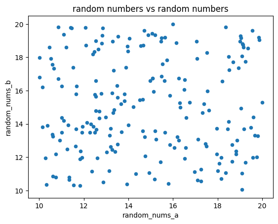

# Correlation Coefficient

_**This is a Makers Bite.** Bites are designed to train specific skills or
tools. They contain an intro, a demonstration video, some exercises with an
example solution video, and a challenge without a solution video for you to test
your learning. [Read more about how to use Makers
Bites.](https://github.com/makersacademy/course/blob/main/labels/bites.md)_

## Learning Objectives

By the end of this chapter, you should be able to:

- Explain what the correlation coefficient represents
- Calculate the correlation coefficient of two variables 


## Introduction

We often get faced with questions like: 
- Are older trees taller?
- Do faster lions catch more wildebeast?
- Are hotter stars brighter?

We may go out and gather data:

```python
'tree_ages': [2, 5, 7, 8, 14, 16, 17, 25, 32, 33],
'tree_heights': [1.8, 3.6, 4.1, 3.9, 7.2, 7.5, 8.1, 11, 15, 14.1]
```

And then plot the age and height of each tree on a scatter diagram:


We could conclude: "Yes, older trees tend to be taller than younger trees. But not always."

The aim of this chapter is to introduce a value we can calculate which will tell us how strongly related two measurements are. That value is called the `correlation coeficient`. It takes values from `-1` to `1` inclusive. An important thing to notice is that this value can be positive, negative or zero.


 #### *DALC - 02 DATA UNDERSTANDING.*
 - [Click here for more Data Analytics Life Cycle detail.](../../pills/data_analytics_life_cycle.md#2---data-understanding)

___


## Positive correlation

If the `correlation coefficient` is above zero, that indicates `positive correlation`: As one of the two values we are comparing increases, the other also increases (not necessarily by the same amount, or even in every case, but generally). So older trees are taller.

Our example with the trees doesn't produce an absolutely straight line. But there is a straight line which will go close to most of the trees. We call such a line the `line of best fit`.


If all our trees were on that line, then the `correlation coefficient` would be the maximum of `1`, but they are just a little off from that. So the correlation coefficient will be a little less than `1`. 

## Exercise

We can quickly calculate the `correlation coefficient` for our tree data with yet another handy method from pandas. If you put the data into a `pandas` `DataFrame`, then you may find [this page](https://pandas.pydata.org/docs/reference/api/pandas.DataFrame.corr.html) useful - this gives us the `#corr()` method.

<details>
<summary>Reveal suggested answer</summary>

```python
tree_data = pd.DataFrame({
    'tree_ages': [2, 5, 7, 8, 14, 16, 17, 25, 32, 33],
    'tree_heights': [1.8, 3.6, 4.1, 3.9, 7.2, 7.5, 8.1, 11, 15, 14.1]
})

tree_data.corr()
```

</details>


You should get a `correlation coefficient` of `0.995574` 
___
The [British Medical Journal](https://www.bmj.com/about-bmj/resources-readers/publications/statistics-square-one/11-correlation-and-regression) suggests these value ranges for the absolute value of our `correlation coefficient`:

- 0-0.19 is regarded as very weak
- 0.2-0.39 as weak
- 0.40-0.59 as moderate
- 0.6-0.79 as strong and
- 0.8-1 as very strong correlation

"but these are rather arbitrary limits, and the context of the results should be considered."

## Negative correlation

If the `correlation coeffiecient` is less than zero, that indicates `negative correlation`: As one of the values we are comparing increases, the other decreases. For example: heavier cars get fewer miles per gallon.


While there still seems to be a clear trend, this data seems more scattered than the previous one. The `correlation coefficient` will be negative and weaker than we saw before. 

## Exercise

Navigate to the `auto-mpg.csv` file in the data folder found inside the "Intro To Data Analysis" folder and calculate the `correlation coefficient` for the weight of the car and the miles per gallon it gets. (If you use the method indicated above, the output is a table. You will need to interpret that table to get the answer we need, or specify the columns required.)

<details>
<summary>Reveal suggested answer</summary>

```python
fuel_data = pd.read_csv("../../data/smaller-datasets/auto-mpg.csv")
fuel_data.corr()

# OR

fuel_data[['mpg', 'weight']].corr()
```

The above tries to calculate the `correlation coefficient` for every pair of columns. (It can't for some, because they aren't numerical). The number we want is: `-0.831741` 

That's not too far from `-1`, so a straight line isn't too bad an approximation. In fact, the `British Medical Journal` recommendation given above would describe it as `strong negative correlation`.

</details>

## No correlation

Zero indicates no correlation. If you plot your data, it would not indicate a trend that can be approximated with a straight line. The data might still be related.

## Exercise

Try and create some data with a `correlation coefficient` of zero. You might find it more convenient to work in a `Jupyter` notebook.

- Create two `pandas` series objects, each with random numbers as entries. 
- Plot a scatter diagram of this random data
- Calculate the `correlation coefficient` of your two series

Useful links: 
- [Random numbers](https://docs.python.org/3/library/random.html)
- [Plotting a scatter diagram](https://pandas.pydata.org/pandas-docs/version/0.25.0/reference/api/pandas.DataFrame.plot.scatter.html) with `pandas` (we have previously done this with `matplotlib`)
- [Calculating the correlation coefficient](https://pandas.pydata.org/docs/reference/api/pandas.Series.corr.html)

<details>
<summary>Reveal suggested answer</summary>

See this [notebook](../notebooks/05_coefficients_rnd_nums.ipynb) for more examples.

</details>

___

It's very difficult to get exactly zero for the `correlation coefficient` with random numbers. I got `0.00084` in one attempt. And `0.17586` in another. Both numbers are pretty close to zero so, going by the `British Medical Journal` scale above (between `0 to 0.19`), I would be justified to call it `very weak correlation`. 

 When you look at the scatter diagram it would be fair to conclude that there wasn't much of a relationship between one set of random numbers and the other.



Let's try again:

## Exercise

You will still need two `pandas` series objects. The first will be full of random numbers again, some positive and some negative. But fill the second with the square of each element in the first. This way we will hard-wire a relationship into the two lists of numbers. We want to get even closer to zero! It sounds counter-intuitive, but...

Find the `correlation coefficient` for your set of data.

Extra challenge: Try other functions, like `cosine`.

<details>
<summary>Reveal suggested answer</summary>

See this [notebook](../notebooks/05_coefficients_squaring.ipynb).
</details>

This is a scatter graph of data that has `correlation coefficient = 0`
 (Taken from the second example in the suggested answer).

At this point, you may be wondering why the `correlation coefficient` is zero when there is clearly a relationship in the data. We can see a `parabola` in the scatter diagram and we know exactly what the relationship is - we hard-coded it! 

Here's the point: getting a near-zero `correlation coefficient` does NOT mean that the data is unrelated. It only means that we cannot approximate the relationship well with a straight line.

## A quick intro into predicting

Since we have noticed that there is a connection between the age of a tree and its height, let's try and estimate the height of a tree that is 30 years old. Though it could be done with a calculation, there is no need at this stage. You can use the graph with a `line of best fit` we had before: 


<details>
<summary>Hint 1</summary>

Find a value of 30 years on the `tree_ages` axis. Then go up to the `line of best fit`
</details>


<details>
<summary>Answer: Estimating the height of the tree</summary>

My working is in this diagram:


It looks like the height would be between `13m` and `14m`. I think, closer to `13m`. There isn't any reason to be more accurate.

</details>

## Demonstration
*Coming soon*

## Challenge
Can you calculate the `correlation coefficient` for our tree data with just a calculator? Google the process.


## Submitting Your Work

**No need to submit just yet, retain this information, perhaps in the notebook you have been using for reference in future challenges**


[Next Challenge](06_Visualising.md)

<!-- BEGIN GENERATED SECTION DO NOT EDIT -->

---

**How was this resource?**  
[😫](https://airtable.com/shrUJ3t7KLMqVRFKR?prefill_Repository=makersacademy%2Fintro-to-data-analysis&prefill_File=stats_bites01%2Fbites%2F05_CorrelationCoefficient.md&prefill_Sentiment=😫) [😕](https://airtable.com/shrUJ3t7KLMqVRFKR?prefill_Repository=makersacademy%2Fintro-to-data-analysis&prefill_File=stats_bites01%2Fbites%2F05_CorrelationCoefficient.md&prefill_Sentiment=😕) [😐](https://airtable.com/shrUJ3t7KLMqVRFKR?prefill_Repository=makersacademy%2Fintro-to-data-analysis&prefill_File=stats_bites01%2Fbites%2F05_CorrelationCoefficient.md&prefill_Sentiment=😐) [🙂](https://airtable.com/shrUJ3t7KLMqVRFKR?prefill_Repository=makersacademy%2Fintro-to-data-analysis&prefill_File=stats_bites01%2Fbites%2F05_CorrelationCoefficient.md&prefill_Sentiment=🙂) [😀](https://airtable.com/shrUJ3t7KLMqVRFKR?prefill_Repository=makersacademy%2Fintro-to-data-analysis&prefill_File=stats_bites01%2Fbites%2F05_CorrelationCoefficient.md&prefill_Sentiment=😀)  
Click an emoji to tell us.

<!-- END GENERATED SECTION DO NOT EDIT -->
