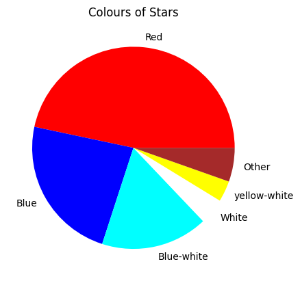
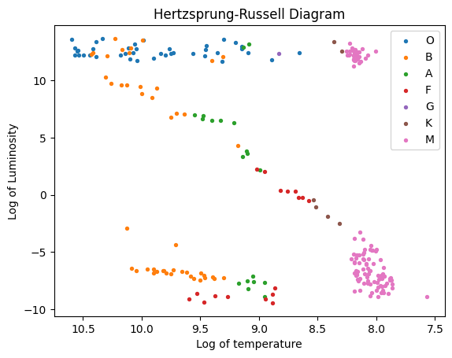

# Visualising Data

_**This is a Makers Bite.** Bites are designed to train specific skills or
tools. They contain an intro, a demonstration video, some exercises with an
example solution video, and a challenge without a solution video for you to test
your learning. [Read more about how to use Makers
Bites.](https://github.com/makersacademy/course/blob/main/labels/bites.md)_

## Learning Objectives

By the end of this chapter you should be able to:

- Explain why visualising data is important.
- Visualise some descriptive statistic elements in order to validate a theory.

## Introduction
In the previous chapter on [descriptive statistics](02_DescriptiveStatistics.md), we found ways to summarise a list of numbers (of any length) by quoting the `mean`, `median` and `mode`. We've also seen the `range`. And there are more out there, like `variance` and `standard deviation`. We've summarised the connection between two of the columns in our data by quoting the `correlation coefficient`. 

All of this should give us a nice variety of ways to summarise our data. We've also noted some of the pitfalls with these summaries. 

In this chapter, we will be looking at a simple method to gain insight into the provided data that helps us see important things that the mere quoting of a descriptive statistic won't convey. That method is to visualise the data. We will use scatter graphs and pie charts. 


 #### *DALC - 02 DATA UNDERSTANDING.*
 - [Click here for more Data Analytics Life Cycle detail.](../../pills/data_analytics_life_cycle.md#2---data-understanding)

___


## Coming onto the stage now: The Anscombe Quartet

In the smaller datasets folder, there is a `csv` file containing four sets of data. You will see that the columns are labelled `x1`, `y1` and then `x2`, `y2` etc. So four pairs of columns for us to investigate.

## Exercise

Calculate the following for each of the columns given

- The mean of each `x` column 
- The mean of each `y` column
- The correlation coefficient for every pair of columns: (x1, y1), (x2, y2), (x3, y3) and (x4, y4)


<details>
<summary>Reveal suggested answer</summary>

You should have found that
- every `x` column has a mean of 9
- every `y` column has a mean of 7.50 (to 2 decimal places)
- the correlation coefficient for each pair is 0.816 for each pair (to 3 decimal places)
</details>

Anscombe created these data sets to illustrate that just crunching the numbers can be misleading. The summaries we have made are important, but we cannot let ourselves forget that every summary has left out some features.

## Exercise 2

Plot each pair of columns on its own scatter graph. What do you notice now that you can "see" the data?

<details>
<summary>Reveal suggested answer</summary>

I made an interactive notebook to [visualise Anscombe's quartet](../notebooks/06_Visualising_Anscombe.ipynb). It includes the coefficients for the line of best fit. If you want to find these yourself, have a go before looking at my answers. (Your answer didn't need to be interactive).

Data set 2 reminds me of what we saw when we were plotting square numbers. There looks like there is a strong connection between the `x` and `y` values, but a straight line probably isn't the best -- even though the `correlation coefficient` is telling us that this approach is reasonable.

All of the quartet have (near enough) the same line of best fit. But for set 3, this line doesn't actually look like the best. 

Set 4, when visualised, makes clear that `x` is nearly always `8`. Did you notice that when you saw the mean was `9`? Why would you? 
</details>

## Exercise 3

Does seeing the scatter graph strengthen or weaken the conclusion that there is a connection between `x4` and `y4`? 

<details>
<summary>Hint to help you consider this</summary>

Make your own data set where `x` always takes the same value (let's say `5`) and the computer chooses random values for `y`. What do you get as the `correlation coefficient`?

Surely the line of best fit is `x = 5`

Can you get that out of `numpy`?
</details>

<details>
<summary>Another hint</summary>

When I followed the first hint (see this [notebook](../notebooks/06_vertical_line_of_best_fit.ipynb)), I got a correlation coefficient of `nan` = `Not a number`

If I go about trying to get a line of best fit using the same method as before, then how is `numpy` supposed come up with the line `x = 5`? I get a warning when running my program. And every time I run the program, I get a different "line of best fit" because the `y` values change. 

What is `numpy` trying to do when we ask it to find a line of best fit?
</details>

<details>
<summary>Reveal suggested answer</summary>

If we try to predict `y` using an equation like `y = ax + b`, but `x` always takes the value of `5`, then `y` will always have the value `5a + b`

But the data tells us that `y` varies quite a bit. In fact: we can make `y` vary as much as we like while keeping `x` the same. So how is using such a line of best fit useful?

On the other hand, the seemingly obvious line `x=5` tells us absolutely nothing about `y`

I would conclude that these two columns of data are NOT connected.
</details>

## Further reading
If you want to go further into this, there are some links on the [wiki](https://en.wikipedia.org/wiki/Anscombe%27s_quartet) page. 

And please look at the scatter diagrams for [Datasaurus](https://cran.r-project.org/web/packages/datasauRus/vignettes/Datasaurus.html). The things statisticians get up to...

## So 'red' is the favourite colour of stars

Earlier on, we found the `modal` colour for our data set of stars. It turned out to be red. That doesn't say much by way of summary. We did produce a frequency table, and we could quote percentages using that. But a pie chart would be a more intuitive summary of what proportion of the stars is each colour.

## Exercise 4

Draw a pie chart of the colours of stars. Display the top five colours and group the rest into "other". 

In this exercise, the colour of the stars and the `Color` category are a prime example of the `Nominal` Statistical Data Type.

<details>
<summary>Reveal suggested answer</summary>

``` python
star_colours = stars['Color']

top_five = stars['Color'].value_counts().nlargest(5)

print(top_five)

colours = star_colours.apply(lambda x: x if x in top_five else 'other')

print(colours.value_counts())

stars['Color'].sort_values()
category_colors = ['red', 'blue', 'cyan', 'gray', 'white', 'yellow']

plt.pie(colours.value_counts(), labels=colours.value_counts().index, colors=category_colors )
plt.show()
```


</details>

## Exercise
I conducted a survey amongst my friends, regarding which coding sites they had accounts on. These were the results:


| site      | number of friends |
|------------|-----------------|
| `stackoverflow` | 39 |
| `codewars` | 33 |
| `hacker rank` | 28 |
| `leetcode` | 22 |

Which would give us more insight into this data? A bar chart or a pie chart?

> *Bonus question:*
> - Name the Statistical Data Type for `site`, and also for `number of friends`.

<details>
<summary>Reveal suggested answer</summary>
<br>

Drawing a piechart would imply that there is no overlap in this data. Otherwise: how would you find out how many friends I asked? Are the 39 friends on `stackoverflow` all of the sample, or half of them?

> The column `site` is a `Nominal` Data Type.
> The column `number of friends` is a `Discrete` Data Type.
</details>

## Challenge

We have previously mentioned the [Hertzsprung-Russel diagram](https://en.wikipedia.org/wiki/Hertzsprung%E2%80%93Russell_diagram). 



As you may remember: we made this diagram by plotting each of our 240 stars according to the log of its temperature and luminosity. The result doesn't look random. It reveals various groupings of stars:

- One along the top where luminosity doesn't appear to be related to temperature. There's almost a flat line. (`Giants`)
- Another group near the bottom, where there is perhaps a gentle slope, where cooler stars are slightly less bright. (`White dwarves`)
- A line of stars from top left to bottom right, where cooler stars are definitely less bright. (`Main sequence`)
- A clump of stars at the end of the above line. (`Brown dwarves`)

The colour coding in our version of the diagram doesn't show this. Our colour coding is based on spectral class rather than the types named above. Can you create another column to marks stars in the four given groups? Then make a version of the diagram with better colour coding.

Think about how you would identify stars in those groups from the data that is already there. Use pandas. Don't go through the `csv` file one row at a time!

/** EDU
Students need to select each of the four groups with limits on values of log(luminosity) and log(temperature). eg: giants all have log(luminosity) > 10

Some overlap can be handled by looking at spectral class.


## Submitting Your Work

Use [this form](https://airtable.com/shr6mk28x0fy3OrxN?prefill_Item=data_eng_stats02) to submit your code and screen recording


[Next Challenge](07_CorrelationAndCausation.md)

<!-- BEGIN GENERATED SECTION DO NOT EDIT -->

---

**How was this resource?**  
[😫](https://airtable.com/shrUJ3t7KLMqVRFKR?prefill_Repository=makersacademy%2Fintro-to-data-analysis&prefill_File=stats_bites01%2Fbites%2F06_Visualising.md&prefill_Sentiment=😫) [😕](https://airtable.com/shrUJ3t7KLMqVRFKR?prefill_Repository=makersacademy%2Fintro-to-data-analysis&prefill_File=stats_bites01%2Fbites%2F06_Visualising.md&prefill_Sentiment=😕) [😐](https://airtable.com/shrUJ3t7KLMqVRFKR?prefill_Repository=makersacademy%2Fintro-to-data-analysis&prefill_File=stats_bites01%2Fbites%2F06_Visualising.md&prefill_Sentiment=😐) [🙂](https://airtable.com/shrUJ3t7KLMqVRFKR?prefill_Repository=makersacademy%2Fintro-to-data-analysis&prefill_File=stats_bites01%2Fbites%2F06_Visualising.md&prefill_Sentiment=🙂) [😀](https://airtable.com/shrUJ3t7KLMqVRFKR?prefill_Repository=makersacademy%2Fintro-to-data-analysis&prefill_File=stats_bites01%2Fbites%2F06_Visualising.md&prefill_Sentiment=😀)  
Click an emoji to tell us.

<!-- END GENERATED SECTION DO NOT EDIT -->
