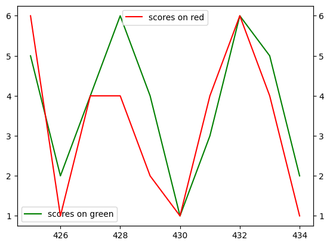

# Correlation and Causation

_**This is a Makers Bite.** Bites are designed to train specific skills or
tools. They contain an intro, a demonstration video, some exercises with an
example solution video, and a challenge without a solution video for you to test
your learning. [Read more about how to use Makers
Bites.](https://github.com/makersacademy/course/blob/main/labels/bites.md)_

## Learning Objectives
After this part of the course you will be able to
- Explain why the value of the `correlation coefficient` doesn't tell us how (or if) one value influences another.
- Consider alternatives to concluding a causal connection between one set of data and another.

## Introduction

Our brains are excellent at spotting patterns. Ben Goldacre, the author of “Why Clever People Believe Stupid Things”, discusses how our minds try to trick us – they:

- See patterns in random noise
- See causal relationships where there are none
- Seek out information that confirms our idea
- Overvalue information that confirms our ideas
- Assess quality of data based on previous beliefs

There is a danger that the statistics we have learned can add a layer of "mathematical certainty" that isn't justified. We can fool ourselves as well as others.

In the chapter on `correlation coefficient`, we found that we could get very low (even zero) correlation between numbers and their squares even though there was clearly a connection. So it's worth remembering that the `correlation coefficient` is not telling us how connected our data is. 

It is also possible to get the `correlation coefficient` to be close to `1` or `-1` when there is no connection between the data. The [Spurious Correlations](https://www.tylervigen.com/spurious-correlations) website has collected a few of these. Have a look through some of them, let us know about the funny ones!

Some of what you will see is just down to chance. There are millions of data sets. Some will trend up, some will trend down and some will just stay roughly the same going up and down. If you look hard enough, you will find unrelated data that trends in the same way.

But there can be other reasons. In this bite, we will discuss some of those reasons.

- Small sample size
- Cherry-picking data
- Confounding factors


 #### *DALC - 02 DATA UNDERSTANDING.*
 - [Click here for more Data Analytics Life Cycle detail.](../../pills/data_analytics_life_cycle.md#2---data-understanding)

___

## Exercise 

Note: This example isn't being serious about the problem of psuedo-random numbers.

Previously, we tried make data with low correlation by picking random numbers. As done in [this notebook](../notebooks/05_coefficients_rnd_nums.ipynb). We didn't quite get zero with random numbers that time. Well, you may have heard that computers aren't actually able to pick random numbers -- they are just `pseudo-random numbers`. So let's use some dice. A red one and a green one. Here is my collected data, after two rolls of each die:

```python
{
   "scores on red": [3, 5],
   "scores on green": [2, 1]
}
```

Plot a `scattergraph`, with a `line of best` fit and find the `correlation coefficient`. Surely it will be very close to zero, after all this is *_genuinely_* random.

<details>
<br>
<summary>Reveal suggested answer</summary>

You should have got a `correlation coefficient` of `-1`.
</details>
<br>

What went wrong? I didn't fake the data. If you doubt this, get some dice and collect your own data for two rolls of each.

Does this mean that the dice are connected? The more I score on one, the less I score on the other? It's too early to conclude that.

Why is it important in this study that you only need two points to make a line?

<details>
<summary>Reveal suggested answer</summary>
<br>

The `correlation coefficient` measures how well the data can be approximated by a straight line. Well this data is exactly a straight line, because there are only two data points.
</details>
<br>

So two rolls of each die is not going to be enough -- our sample is too small. Try adding more rolls to your data and see what you get. (You can simulate rolls with a computer, if you like). `10` rolls of each die would certainly be more convincing.

## Cherry picking exercise

This is about fixing the outcome of our study by selecting supporting data.

Let's go back to trusting the computer to pick random numbers so we can simulate dice rolls. This [notebook](../notebooks/07_cherry_picking_dice_rolls.ipynb) asks you to set up a data set with (to begin with) 200 rolls for a red die and 200 rolls for a green die. From this data, we want to `cherry pick` the data that makes the best case that the rolls of the dice are correlated. 

I managed to find a correlation of `0.83` for 10 rolls amongst 1000 I asked the computer to simulate. Those 10 rolls make this graph, with index at the bottom and scores for each die on each side. The green and red follow each other, but only in this snapshot. The correlation for the 1000 rolls was very close to zero: `0.00967`



## Confounding Factors

The classic example is: sales of ice-cream and sunburn. Whether anyone has actually collected the data behind the classic story, I don't know. But here it is:

Ice-cream sales and sunburn are highly correlated. As one goes up, so does the other. Does one cause the other? Is it coincidence? Or something else?

When we find strong correlation in our data, we should at least keep an open mind to the possibility that there is another factor involved. In the case above: perhaps warmer weather causes both higher ice-cream sales and more sunburn. If that were the case, then the weather would be a `confounding factor`.

## Exercise
Take a look through some [spurious correlations](https://www.tylervigen.com/spurious-correlations) and see if you can think of possible confounding factors.


## Challenge
We are not looking for you to become a physicist when considering the following challenge. Your job is to consider the data. 

Consider the following assertion, based on the given data: `the length of a planet's orbit is entirely predictable from the planet's distance from the sun?`

The data is in this [notebook](../notebooks/02_planetary_orbits.ipynb), which you might have seen already. And there is more information at wiki: [Kepler's third law on planetary motion](https://en.wikipedia.org/wiki/Kepler%27s_laws_of_planetary_motion). 

As a summary, remember that (after cubing the distance to the sun, and squaring the number of days for a full orbit) we got a straight line on a scatter graph and a `correlation coefficent` of `0.999984`. 

## Submitting Your Work

**No need to submit just yet, retain this information, perhaps in the notebook you have been using for reference in future challenges**

We will come back to Correlation in the next Phase - `Stats02`.

<!-- OMITTED -->
## Up next

[Predictive Statistics.](../../stats_bites02/00_intro_prescriptive_stats.md)

<!-- BEGIN GENERATED SECTION DO NOT EDIT -->

---

**How was this resource?**  
[😫](https://airtable.com/shrUJ3t7KLMqVRFKR?prefill_Repository=makersacademy%2Fintro-to-data-analysis&prefill_File=stats_bites01%2Fbites%2F07_CorrelationAndCausation.md&prefill_Sentiment=😫) [😕](https://airtable.com/shrUJ3t7KLMqVRFKR?prefill_Repository=makersacademy%2Fintro-to-data-analysis&prefill_File=stats_bites01%2Fbites%2F07_CorrelationAndCausation.md&prefill_Sentiment=😕) [😐](https://airtable.com/shrUJ3t7KLMqVRFKR?prefill_Repository=makersacademy%2Fintro-to-data-analysis&prefill_File=stats_bites01%2Fbites%2F07_CorrelationAndCausation.md&prefill_Sentiment=😐) [🙂](https://airtable.com/shrUJ3t7KLMqVRFKR?prefill_Repository=makersacademy%2Fintro-to-data-analysis&prefill_File=stats_bites01%2Fbites%2F07_CorrelationAndCausation.md&prefill_Sentiment=🙂) [😀](https://airtable.com/shrUJ3t7KLMqVRFKR?prefill_Repository=makersacademy%2Fintro-to-data-analysis&prefill_File=stats_bites01%2Fbites%2F07_CorrelationAndCausation.md&prefill_Sentiment=😀)  
Click an emoji to tell us.

<!-- END GENERATED SECTION DO NOT EDIT -->
