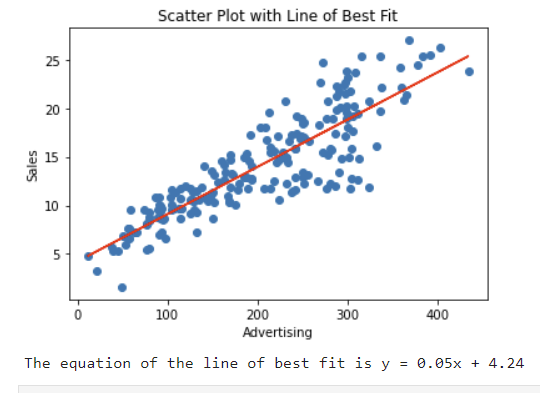

# Linear Regression

---
## Learning Objectives
 
After completing this bite on Simple Linear Regression, you should be able to:
- Understand what simple linear regression is and when it is appropriate to use.
- Be able to interpret the coefficients of a simple linear regression model.
- Fit and evaluate a simple linear regression model using appropriate techniques.
- Use a simple linear regression model to make predictions on new data.
- Know the limitations of simple linear regression.

---
## Introduction

**Simple** linear regression is used to model the relationship between a *continuous* **dependent variable** and a **single independent variable**. 
The goal is to find a **linear equation** that best describes the relationship between the two. This equation can be used to make predictions or forecasts about the dependent variable.

#### Independent and Dependent Variables

Earlier in this module we analysed the Colours, Luminosity (Brightness), and Size of stars.

If we were to return to the study of stars, we might want to analyze the relationship between star color and brightness.

In this case:

The **dependent variable** would be the `Luminosity` of the star. It is called the dependent variable because it *depends* on the **independent variable** (star `Color`). 
The brightness (`Luminosity`) is the thing we are trying to understand or predict based on the independent variable.

The **independent variable**  would be the `Color` of the star. It is called the independent variable because it is not influenced by any other variable in the context of this analysis. We are interested in studying how changes in the independent variable (star `Color`) affect the dependent variable (`Luminosity`).

By analyzing the data, we can (and have) investigate if certain colors of stars tend to be brighter or not. 
___

### Examining Relationships
Suppose you work for a supermarket chain. Each month the amount of the advertising spent is recorded with the number of sales:

The marketing team wants to know how many sales can be expected with a specific advertising budget.

To provide the answer, it helps to
- examine the correlation between the two variables, to
- create a model, or **'Line of Best Fit'**, and to
- know how to determine the **'goodness of fit'** for such a model.

Correlation measures the strength and direction of the relationship between two variables, while the line of best fit represents the equation of the straight line that best approximates this relationship.
___
## Correlation

Correlation measures the linear relationship between two variables. It is a value between -1 and +1:

- if the value is **0**, there is **no correlation**.
- If it's **1**, then there is perfect **positive correlation*.
- If it's **- 1**, then there is perfect **negative correlation**.

If we look at the scatter graphs, we can see a pattern that indicates the relationship.

 ___

## Line of Best Fit (LBF)

Our aim is to use a model that explains the relationship between our variables. When the relationship between the variables is linear, we can use the existing data points and draw a **straight line** that fits as closely as possible to these data points.

Again, our goal with a Line of Best Fit in the context of Linear Regression is to **minimize the distance between all the data points and our line**.

The method involves trying different lines and calculating the sum of the squared differences between the actual data points and the corresponding predicted values. The goal is to find the line that minimizes this sum of the squared differences, which is why it's called the [least squares method.](https://www.youtube.com/watch?v=jEEJNz0RK4Q)
Using python packages like `numpy` or `statsmodels` help to determine this model, i.e. the equation of the line.

### Equation of a line
A line can be described by a mathematical equation. The general form for an equation is
**y = mx + c**.

A line equation has two parts: 
- the **slope** (**m**) and the 
- **y-intercept** (**c**).

The slope tells us how steep the line is, which means how much y changes when we change x.

The y-intercept tells us where the line crosses the y-axis, which is the <kbd>y</kbd> value when <kbd>x</kbd> is `0`. - (if you recall the [Sunflower Workshop](../../workshops/flower_growth.md) this is the height of the Sunflower at the very start - `5cm`, when days is `0`.)

### Computing the LBF
We can compute the line of best fit with the help of NumPy and the [polyfit](https://numpy.org/doc/stable/reference/generated/numpy.polyfit.html)-function.

**Example:** 
Let's say the polyfit function for a dataset gives us the following equation:

**y = 5x + 4.25**

We can use the equation to make a prediction by calculating y for a given value x = 200. 

y = 5 * **200** + 4.25 = 1004.25

### Using the LBF visually 
Looking at a scatter graph with the line of best fit, we can determine our estimated sales numbers visually.

### Exercise 
For this exercise, we are using 
- the Jupyter notebook [01_Simple_Linear_Regression.ipynb](../notebooks/01_Simple_Linear_Regression.ipynb) and
- the dataset [SLR_advertising_budget.csv](../datasets/SLR_advertising_budget.csv).

Look at the code and work through the code cells for the marketing example. 
Start with the data exploration and familiarise yourself with the data.
- What is the equation for the line of best fit? 
- Can you predict the sales number for an advertising spent of 500 GBP?

Reveal suggested answer

- y = 0.0487x + 4.2430
- The estimated number of sales: 28.59

Remember we can find <kbd>y</kbd> by running `model.summary()` and looking at the column name (in this case `Advertising`) coefficient, and can find <kbd>c</kbd> by looking at the `const` coefficient.

 

[Next Challenge](02_linear_simple_linear_regression_model_validation.md)

<!-- BEGIN GENERATED SECTION DO NOT EDIT -->

---

**How was this resource?**  
[😫](https://airtable.com/shrUJ3t7KLMqVRFKR?prefill_Repository=makersacademy%2Fintro-to-data-analysis&prefill_File=stats_bites02%2Fbites%2F01_simple_linear_regression_intro.md&prefill_Sentiment=😫) [😕](https://airtable.com/shrUJ3t7KLMqVRFKR?prefill_Repository=makersacademy%2Fintro-to-data-analysis&prefill_File=stats_bites02%2Fbites%2F01_simple_linear_regression_intro.md&prefill_Sentiment=😕) [😐](https://airtable.com/shrUJ3t7KLMqVRFKR?prefill_Repository=makersacademy%2Fintro-to-data-analysis&prefill_File=stats_bites02%2Fbites%2F01_simple_linear_regression_intro.md&prefill_Sentiment=😐) [🙂](https://airtable.com/shrUJ3t7KLMqVRFKR?prefill_Repository=makersacademy%2Fintro-to-data-analysis&prefill_File=stats_bites02%2Fbites%2F01_simple_linear_regression_intro.md&prefill_Sentiment=🙂) [😀](https://airtable.com/shrUJ3t7KLMqVRFKR?prefill_Repository=makersacademy%2Fintro-to-data-analysis&prefill_File=stats_bites02%2Fbites%2F01_simple_linear_regression_intro.md&prefill_Sentiment=😀)  
Click an emoji to tell us.

<!-- END GENERATED SECTION DO NOT EDIT -->
