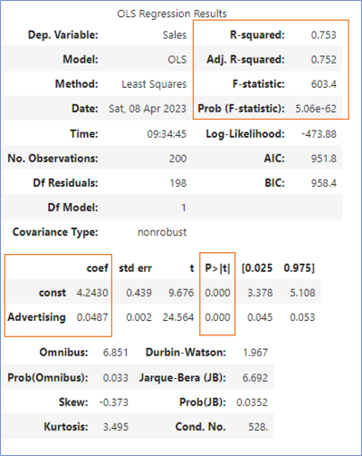
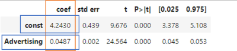
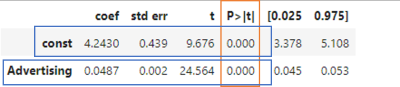
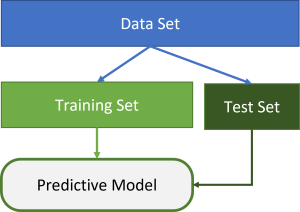

# Simple Linear Regression - Model Validation


## Learning Objectives
---
- Determine the accuracy of a Simple Linear Regression model.
- Interpret the regression results from Statsmodels to determine the equation for the line of best fit.
- Explain the significance of p-values and determine which independent variables have a significant effect on the dependent variable.
- Interpret R-squared and Adjusted R-squared to determine how closely the data fits the model 
- Evaluate the performance of a Simple Linear Regression model by comparing it with a base model using F-statistic and Prob (F-Statistic).


## Determine the accuracy of the model
---
With the line of best fit we have created a mathematical model to represent a real-world situation. However, no model can perfectly capture all aspects of the real world as they are based on data that may have measurement errors or may not fully represent all aspects necessary.

By using further statistical methods, we can determine how good our model is and if we can use it to make some valid predictions.\
To do this, we will need to import additional statistical software packages (i.e. `statsmodels`) to get a model summary, and we will cross-validate our findings with the help of machine learning.

`Statsmodels` gives us various **Regression results**, but we will focus on the most important ones.
<br>




### Determine the LBF equation from the results
Previously we have used the `numpy` polyfit function to determine the equation for the Line of Best Fit. However, now that use `Statsmodels` we can get the equation from the regression results. We can see this by using `model.summary()`:



y = m*x + b\
y = **0.0487**x + **4.2430**

Should you want to verify <kbd>m</kbd>:

<details>
    <summary> This is how you can find the slope  or <kbd>m</kbd></summary>
    <br>
    <p>To work out the slope value (<kbd>m</kbd>) from the given data, you can use the formula for calculating the slope of a linear regression line:


`m = (sum(x_i * y_i) - n * x_mean * y_mean) / (sum(x_i^2) - n * x_mean^2)`
<p>
Though you shouldn't need to do this manually as we can find it via the <kbd>model.summary()</kbd> function.

Remember <kbd>m</kbd> is simply what the <kbd>y</kbd> goes up by for every unit of <kbd>x</kbd>.
</details>


### p-value

A p-value ***&lt; 0.05*** suggests that our data is statistically significant and the values for our variable cannot be explained by mere coincidence. It helps us to identify which independent variables have a significant effect on the dependent variable.\
    


### R-squared
R-squared tells us how closely the data fits the model between 0 (terrible fit) and 1 (perfect fit). In our case, 75.3% is high - you should expect to achieve closer to 30% in a good real-world example.
30% is usually sufficient because we are not trying to describe exactly the dependent variable (since we don’t have all the data); we just want to give an estimate as to what might happen under small changes. Despite not describing everything, the model still has practical use!


### Adjusted R-squared
Adjusted R-squared is similar to the R-squared but is for models with more than one independent variable.


### F-Statistic
F-statistic is a test to compare two models. In this case, it is comparing our regression model to the base model (taking the mean). A high F value (> 1) means the new model is better. A low F value (&lt; 1) means the old model is better.


### Prob (F-Statistic)
Prob (F-Statistic) tells us how statistically significant this value is. The lower the probability, the more significant the difference between models. In our case, our regression model is MUCH better than the base model in a statistically significant way.

## Cross-validation of the model with machine learning
---

If we use the entirety of a data set, the model is trained based on this data. But how do we know the model will still be able to predict new values?
We are using the package `sklearn`, a machine learning package.

We can use this to split our data frame randomly into two data sets: the training set and the test set.

\
The training set is used to train our machine learning model, and the test set is used to evaluate how well the model is performing. The reason for this is that we want to ensure that our model is not just memorising the data we give it but is instead learning how to generalise and make accurate predictions on new, unseen data.

### Exercise
For this exercise, we are using 
- the Jupyter notebook [02_SLR_Model_Validation.ipynb](../notebooks/02_SLR_Model_Validation.ipynb) and
- the dataset [SLR_advertising_budget.csv](../datasets/SLR_advertising_budget.csv).

Look at the code and work through the code cells for the marketing example. 
Start with the data exploration and familiarise yourself with the data.
- What is the equation for the line of best fit? 
- Can you predict the sales number for an advertising spent of 500 GBP?

<details>

<summary>Reveal suggested answer</summary>
<br>
- y = 0.0487x + 4.2430
- The estimated number of sales: 28.59

We can verify this via the <kbd>model.summary()</kbd> function, to find the value of <kbd>m</kbd> and <kbd>b</kbd> respectively as they are the const coefficient and 'Advertising' coefficient values here:


Should you need to further verify the slope:
``` python
import numpy as np
n = len(df['Advertising'])
y_mean = np.mean(df['Sales'])
x_mean = np.mean(df['Advertising'])

numerator = np.sum(df['Advertising'] * df['Sales']) - n * x_mean * y_mean
denominator = np.sum(df['Advertising']**2) - n * x_mean**2

slope = numerator / denominator

print("Slope (m):", slope)
```
</details>

## Challenge
For this challenge, you are using 
- the Jupyter Notebook [02_SLR_Salary.ipynb](../notebooks/02_SLR_Salary.ipynb) and
- the dataset [SLR_salary.csv](../datasets/SLR_salary.csv)


## Submitting Your Work

Use [this form](https://airtable.com/shr6mk28x0fy3OrxN?prefill_Item=data_eng_stats03) to submit your code and screen recording

<BR>
    


[Next Challenge](03_multiple_linear_regression.md)

<!-- BEGIN GENERATED SECTION DO NOT EDIT -->

---

**How was this resource?**  
[😫](https://airtable.com/shrUJ3t7KLMqVRFKR?prefill_Repository=makersacademy%2Fintro-to-data-analysis&prefill_File=stats_bites02%2Fbites%2F02_linear_simple_linear_regression_model_validation.md&prefill_Sentiment=😫) [😕](https://airtable.com/shrUJ3t7KLMqVRFKR?prefill_Repository=makersacademy%2Fintro-to-data-analysis&prefill_File=stats_bites02%2Fbites%2F02_linear_simple_linear_regression_model_validation.md&prefill_Sentiment=😕) [😐](https://airtable.com/shrUJ3t7KLMqVRFKR?prefill_Repository=makersacademy%2Fintro-to-data-analysis&prefill_File=stats_bites02%2Fbites%2F02_linear_simple_linear_regression_model_validation.md&prefill_Sentiment=😐) [🙂](https://airtable.com/shrUJ3t7KLMqVRFKR?prefill_Repository=makersacademy%2Fintro-to-data-analysis&prefill_File=stats_bites02%2Fbites%2F02_linear_simple_linear_regression_model_validation.md&prefill_Sentiment=🙂) [😀](https://airtable.com/shrUJ3t7KLMqVRFKR?prefill_Repository=makersacademy%2Fintro-to-data-analysis&prefill_File=stats_bites02%2Fbites%2F02_linear_simple_linear_regression_model_validation.md&prefill_Sentiment=😀)  
Click an emoji to tell us.

<!-- END GENERATED SECTION DO NOT EDIT -->
