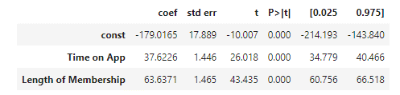

# Multiple Linear Regression

---
## Learning Objectives
 
After completing this bite on Multiple Linear Regression, you should be able to:
- Understand what multiple linear regression is and when it is appropriate to use.
- Be able to interpret the coefficients of a multiple linear regression model.
- Fit and evaluate a multiple linear regression model using appropriate techniques.
- Use a multiple linear regression model to make predictions on new data.
- Understand the concept of collinearity in multiple linear regression.

---
## Introduction
Multiple linear regression is used to model the relationship between a *continuous* **dependent variable** and **two or more independent variables**. The goal is to find a linear equation that best describes the relationship between the dependent variable and all of the independent variables. This equation can be used to make predictions or forecasts about the dependent variable based on multiple factors.
However, as a rule of thumb, you will need a minimum of 30 data points per included variable, e.g.

**Example**

A start-up e-commerce company is trying to optimise its marketing strategy to increase customer engagement and sales. 
They have collected some data related to a customer's behaviour:


They want to understand the key metrics that drive how much a customer spends in a year.


To provide the answer, it helps to
- identify the variables that have the **strongest correlation**,
- create a model, or **'Line of Best Fit'**, and to
- determine the **'goodness of fit'** for such a model.

While most of the steps are similar to our simple linear regression, we need to adapt our approach slightly.

## Correlation
---
We have different independent continuous variables, so we need to check the strength of relationships with the dependent variable. With several variables, the correlation matrix can become hard to read. To get a quick first impression of our data, we can use `seaborn.pairplot()`.
Pairplots are useful for visualising the relationships between multiple variables in a dataset. They can help identify patterns, trends, and correlations between variables. Pairplots are often used in exploratory data analysis (EDA) to gain insights into the data and to guide further analysis.

`sns.pairplot(DataFrame)`


In the above plot, you can visually identify the variables with stronger correlations to our dependent one. This can then be verified with a look at the value of the correlation matrix.

We identify dependent and independent variables, split the data into a train and test set and build our model:

```python
# Identify dependent and independent variables

dependent_var = train['Yearly Amount Spent']
independent_var = train[['Time on App', 'Length of Membership']]
independent_var = sm.add_constant(independent_var)

# Build the model 
model = sm.OLS(
    dependent_var,
    independent_var
).fit()
```
We can now show and interpret the model results:

```python
model.summary()
```



## Line of best fit
---
As we have two independent variables, we need to use both coefficients to construct our equation of the LBF:

$$\begin{aligned}
\text{Predicted Yearly Spend } = &+ 37.6 \times \text{[Time on App]}\\
&+ 63.6 \times \text{[Length of Membership]}\\
&-179.1 \\
\end{aligned}$$

We check the rest of our model summary and make predictions against our test data. When the results are convincing, we can rebuild the model on the whole dataset.
### Exercise 1
For this exercise, we are using 
- the Jupyter notebook [03_Multiple_Linear_Regression.ipynb](../notebooks/03_Multiple_Linear_Regression.ipynb) and
- the dataset [MLR_ecommerce_customers.csv](../datasets/MLR_ecommerce_customers.csv).

Look at the code and work through the code cells for the marketing example. 
Start with the data exploration, familiarise yourself with the data and build the model.

Add some code to allow the prediction of the Yearly Amount Spent, based on 30 min on the App and a 3-year membership.

<details>

<summary>Reveal suggested answer</summary>

``` python
pred = model.predict([1, 30, 3])  #Time on App = 30, Length of Membership = 3
    
print(round(float(prediction), 2))

# Returns 1147.39
```

</details>

### Exercise 2
In the previous exercise, we focused on the two variables with the strongest relationships.
Now let's go through the same steps, building the model with ALL variables.
Have a look at the summary output and also the notes at the bottom. What are your thoughts?

<details>

<summary>Reveal suggested answer</summary>

It is always useful to check all the main statistic metrics and the notes in the model as well! \
At first the R-squared value (0.984), the Adjusted R-squared value (0.984) and The F-statistic (5778) suggest this is a good model.
    
However, there are some potential issues with the model if we are using all variables here: 
- The **p-value** for "Time on Website" is 0.442\
This is not statistically significant at the usual significance level of lower than 0.05 and suggests that "Time on Website" may not be a significant predictor of "Yearly Amount Spent." 
- Additionally, the **high condition number** (2.62e+03) suggests that there may be issues with **multicollinearity** among the independent variables. This means that the independent variables may be highly correlated with each other, which can lead to unreliable coefficient estimates and less accurate predictions.

</details>

## Multicollinearity
---
Collinearity occurs when **two or more of our independent variables** in a statistical model are **highly correlated with each other**. 

**Example** \
If we look at the relationship between a person's age and their education level, we may find that as people get older, they tend to have more years of education. 
If we use **both** age and education level as predictors (independent variables) in a model, we may encounter problems with collinearity. This can cause issues such as unstable estimates and misleading results. 

### Exercise 3
For this exercise, you will be using
- the dataset [MLR_advertising_budget.csv](../datasets/MLR_advertising_budget.csv).

Create a new Jupyter notebook and perform a Multiple Linear Regression on the dataset. What do you think causes the problem of collinearity and why?
Try improving the model and compare the results of your attempts.

<details>

<summary>Reveal suggested answer</summary>

The dataset includes a column that summarises the different advertising budgets. This is *redundant* information and causing the collinearity and should be omitted. 
Looking at the model with the remaining variables you can see that 'Newspaper Ad Budget' has a high p-value, indicating  that the variable is not statistically significant and does not have a significant effect on the outcome variable. It should therefore be removed from the model as well.

[You could look at this example](../notebooks/03_exercise_03.ipynb), but only do so after trying to implement the above changes yourself!

</details>

### Challenge
Use the learned skills to perform a MLR on the dataset [MLR_car_price.csv](../datasets/MLR_car_price.csv) to predict the resales price of a car.


## Submitting Your Work

**No need to submit just yet, retain this information, perhaps in the notebook you have been using for reference in future challenges**

<BR>

[Next Challenge](04_logistic_regression.md)

<!-- BEGIN GENERATED SECTION DO NOT EDIT -->

---

**How was this resource?**  
[😫](https://airtable.com/shrUJ3t7KLMqVRFKR?prefill_Repository=makersacademy%2Fintro-to-data-analysis&prefill_File=stats_bites02%2Fbites%2F03_multiple_linear_regression.md&prefill_Sentiment=😫) [😕](https://airtable.com/shrUJ3t7KLMqVRFKR?prefill_Repository=makersacademy%2Fintro-to-data-analysis&prefill_File=stats_bites02%2Fbites%2F03_multiple_linear_regression.md&prefill_Sentiment=😕) [😐](https://airtable.com/shrUJ3t7KLMqVRFKR?prefill_Repository=makersacademy%2Fintro-to-data-analysis&prefill_File=stats_bites02%2Fbites%2F03_multiple_linear_regression.md&prefill_Sentiment=😐) [🙂](https://airtable.com/shrUJ3t7KLMqVRFKR?prefill_Repository=makersacademy%2Fintro-to-data-analysis&prefill_File=stats_bites02%2Fbites%2F03_multiple_linear_regression.md&prefill_Sentiment=🙂) [😀](https://airtable.com/shrUJ3t7KLMqVRFKR?prefill_Repository=makersacademy%2Fintro-to-data-analysis&prefill_File=stats_bites02%2Fbites%2F03_multiple_linear_regression.md&prefill_Sentiment=😀)  
Click an emoji to tell us.

<!-- END GENERATED SECTION DO NOT EDIT -->
