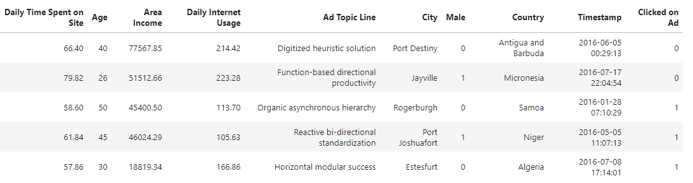
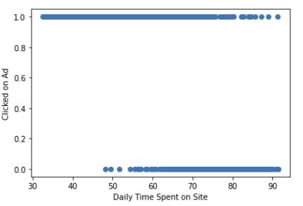
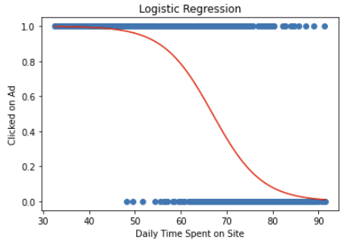
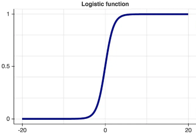
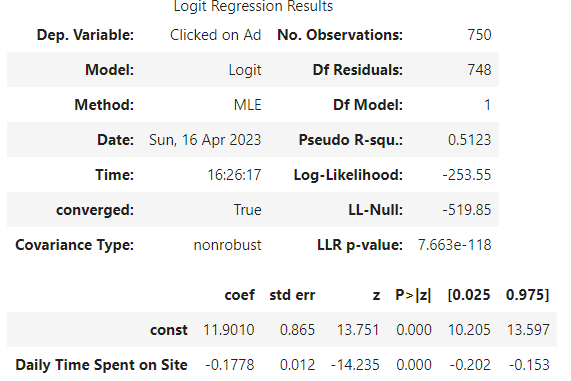

# Logistic Regression

---
## Learning Objectives

After completing this bite on Logistic Regression, you should be able to:

- Understand what logistic regression is and when it is appropriate to use.
- Be able to fit a logistic regression model.

---
## Introduction
Logistic regression is a statistical method used to model the relationship between a **binary dependent variable** and one or more independent variables. The independent variables can be continuous or categorical. 

**A binary dependent variable** is similar to a Boolean in that can only take on values 0 or 1 when observed; it's often indicitive of something qualitative (e.g. married versus not married, approved for a loan versus not approved). It is either is, or it isn't - much like a Boolean.

The goal is to **predict the probability of an event occurring or not occurring** based on the values of the independent variables.

This is helpful when we are looking to classify information, such as whether someone survived as in the Titanic dataset, or whether a team won or lost as in the World Cup dataset.

### Example
In this example, you are tasked with working once more with the marketing team for an ecommerce site, and have been given another dataset. 

This time they want you to predict if a user will click on an online advertisement (1) or not (0).

To provide the answer, it helps to

- examine the correlation between the variables, to
- create a logistic model, and to
- know how to determine the fitness of such a model.

---
## Data Exploration
As usual, you should start with the data exploration and familiarise yourself with the data in the dataset.

**Correlation**\
As you are interested in the dependent variable 'Clicked on Ad', you should concentrate on the strongest correlations here.

**Scatterplot**\
When you have identified the independent variable, you can plot the scattergraph for the data set.

As you can see, the scattergraph looks very different from what we have seen in our linear regression. A line of best fit would not work here. Instead, we are looking for a **sigmoid** (S-shaped) function.

### The Logistic Function
For the linear regression, we have used the line of best fit to make our prediction. However, if we are dealing with the prediction of an event occurring or not, we will use a **logistic function**. This is a function that maps inputs to **probabilities**.

The logistic function is a sigmoidal (S-shaped) function that maps any input value to a value between 0 and 1. 
The mathematical formula for the logistic function is:

y = 1 / (1 + e^(-x))

To get (and use) the model for our predictions, we can use `statsmodel`.

---
## Building the model
`Statsmodels` is a Python module that provides various functions for estimating different statistical models and performing statistical tests.  

First, we define the set of dependent(y) and independent(x) variables. 
Statsmodels provides a **Logit()** function for performing logistic regression. The Logit() function accepts y and X as parameters and returns the Logit object. The model is then fitted to the data.

> model = sm.Logit( 
&nbsp;&nbsp;&nbsp;&nbsp;TrainDataFrame['dependent variable'], 
&nbsp;&nbsp;&nbsp;&nbsp;TrainDataFrame[['independent variable 1', 'independent variable 2', ...]] 
).fit()

With `model.summary()`, we get our model metrics.

### Logit Regression Results

---
## Make a prediction
Similar to our line of best fit, we can now use the coefficients and make a prediction about the probability of Clicking on Ad, e.g. for '*Daily Time Spent on Site*' = 5.\
To do this, we will 
- calculate the logit and then 
- convert the logit to a probability.

### Calculating the logit

>logit = **const** + **coef_Daily_Time_Spent_on_Site** * Daily_Time_Spent_on_Site
logit = **11.9010** **-0.1778** * 5
logit = 11.9010 - 0.889
logit = 11.012

### Converting logit to probability

>P = 1 / (1 + e^-logit) 
P = 1 / (1 + e^-11.012) 
P = 1 / (1 + 0.0000166) 
P = 1 / 1.0000166 
P = 0.9999834

So, the predicted probability of clicking on an add is approximately 0.9999, or 99.99%.

However, we do not know if our model is a good fit. We will look how to validate the model in the next step.
But before we do this, let's exercise!

### Exercise
For this exercise, we are using 
- the Jupyter notebook [04_Logistic_Regression.ipynb](../notebooks/04_Logistic_Regression.ipynb) and
- the dataset [LOG_advertising.csv](../datasets/LOG_advertising.csv).

Go through **Part 1** of the notebook. Look at the code and work through the code cells for the marketing example. 
Start with the data exploration, familiarise yourself with the data and build the model. We will reuse the notebook in the next bite.

## Submitting Your Work

**No need to submit just yet, retain this information, perhaps in the notebook you have been using for reference in future challenges**

[Next Challenge](05_logistic_regression_model_validation.md)

<!-- BEGIN GENERATED SECTION DO NOT EDIT -->

---

**How was this resource?**  
[😫](https://airtable.com/shrUJ3t7KLMqVRFKR?prefill_Repository=makersacademy%2Fintro-to-data-analysis&prefill_File=stats_bites02%2Fbites%2F04_logistic_regression.md&prefill_Sentiment=😫) [😕](https://airtable.com/shrUJ3t7KLMqVRFKR?prefill_Repository=makersacademy%2Fintro-to-data-analysis&prefill_File=stats_bites02%2Fbites%2F04_logistic_regression.md&prefill_Sentiment=😕) [😐](https://airtable.com/shrUJ3t7KLMqVRFKR?prefill_Repository=makersacademy%2Fintro-to-data-analysis&prefill_File=stats_bites02%2Fbites%2F04_logistic_regression.md&prefill_Sentiment=😐) [🙂](https://airtable.com/shrUJ3t7KLMqVRFKR?prefill_Repository=makersacademy%2Fintro-to-data-analysis&prefill_File=stats_bites02%2Fbites%2F04_logistic_regression.md&prefill_Sentiment=🙂) [😀](https://airtable.com/shrUJ3t7KLMqVRFKR?prefill_Repository=makersacademy%2Fintro-to-data-analysis&prefill_File=stats_bites02%2Fbites%2F04_logistic_regression.md&prefill_Sentiment=😀)  
Click an emoji to tell us.

<!-- END GENERATED SECTION DO NOT EDIT -->
