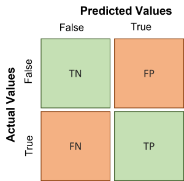
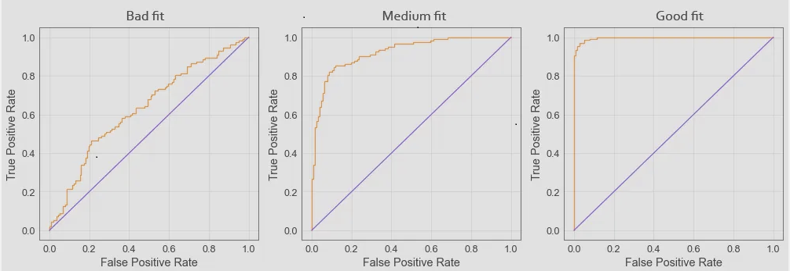

# Logistic Regression - Model Validation

---
## Learning Objectives
- Understand what a Confusion Matrix is.
- Understand what a True Positive Rate is.
- Understand what a True Negative Rate is.
- Evaluate a logistic regression model.
- Use a logistic regression model to make predictions on new data.

---
## Confusion Matrix
So how can we evaluate the performance of our model? First, let's have a look what outcomes our prediction could have.


### Four outcomes
After making predictions with your model, we would have four types of outcomes:

- True Positives (**TP**): User clicked on an ad and the model predicted they would.
- False Positives (**FP**): User did not click on an ad but the model predicted they would.
- True Negatives (**TN**): User did not click on an ad and the model predicted they would not.
- False Negatives (**FN**): User clicked on an ad but the model predicted they would not.

### The Confusion Matrix
With the help of `sklearn.metrics` we can get a **Confusion Matrix** that will give us the numbers for these outcomes



**Example**
``` python
Confusion Matrix:
[[110  13]
 [ 16 111]]
```
TN = 110 \
FN = 16 \
FP = 13 \
TP = 111 


---
## True Positive Rate and True Negative Rate
We are of course interested in the **True Positive Rate** and the **True Negative Rate**.
We can calculate these with the following formulas:

- **True Positive Rate (TPR) = TP / (TP + FN)**: 
This measures the proportion of actual positives that are correctly identified as such.
- **True Negative Rate (TNR) = TN / (TN + FP)**: 
This measures the proportion of actual negatives that are correctly identified as such.

For the example above, we can calculate 
- **TPR** = 111 / (111 + 16) = 0.874 and
- **TNR** = 110/ (110 + 13) = 0.894

:sparkle:
In general, a high **TPR** and **TNR** are both desirable because they indicate that the model is able to correctly identify both positive and negative instances in the dataset. 


---
## Receiver Operating Characteristic curve (ROC)
A more graphical way to represent the performance of our logistic regression model is the ROC. Here we can visual interpret if our model is a good fit or not.


The ROC curve will show how well the model can distinguish between users who click on ads and those who don't. Ideally, we want a curve that is as close to the top left corner of the plot as possible, which corresponds to a high TPR and a low FPR.

If the ROC curve is close to the diagonal line, it means that the model is no better than random guessing. If the ROC curve is below the diagonal line, it means that the model is performing worse than random guessing. In contrast, if the ROC curve is above the diagonal line, it means that the model is performing better than random guessing at distinguishing between the two classes.


## Area Under the Curve (AUC)
The AUC score is also used to evaluate the performance of logistic regression model. It is a single summary statistic that represents the overall performance.

The AUC score ranges from 0 to 1, where a score of 0.5 means the model is no better than random guessing, and a score of 1.0 means the model is perfect at distinguishing between the positive and negative classes. 

:sparkle: The higher the AUC score, the better the model is at correctly predicting the positive or negative outcomes.

```python
metrics.roc_auc_score(test['Clicked on Ad'],predicted)
0.9513475449715126
```

## Exercise
For this exercise, we are using again
- the Jupyter notebook [04_Logistic_Regression.ipynb](../notebooks/04_Logistic_Regression.ipynb) and
- the dataset [LOG_advertising.csv](../datasets/LOG_advertising.csv).

Work through **Part 2 - Model Validation**. Look at the code and familiarise yourself with the code in the cells.


## Challenge

Let's say that we are interested in predicting whether or not a student will pass an exam based on the number of hours they studied and the number of hours they slept the night before the exam. The outcome variable is "Pass" (1 = yes, 0 = no).
The goal of logistic regression in this case would be to find a relationship between the hours studied and slept, and the likelihood of passing the exam. 

For this challenge,
- create a Jupyter notebook and use
- the dataset [student_pass.csv](../datasets/student_pass.csv)

Build and evaluate the logistic regression model.
Make a prediction for a new student who studied for 7 hours and slept 8 hours. \
Will they pass or fail?

## Submitting Your Work

Use [this form](https://airtable.com/shr6mk28x0fy3OrxN?prefill_Item=data_eng_stats04) to submit your code and screen recording


[Next Challenge](06_timeseries.md)

<!-- BEGIN GENERATED SECTION DO NOT EDIT -->

---

**How was this resource?**  
[😫](https://airtable.com/shrUJ3t7KLMqVRFKR?prefill_Repository=makersacademy%2Fintro-to-data-analysis&prefill_File=stats_bites02%2Fbites%2F05_logistic_regression_model_validation.md&prefill_Sentiment=😫) [😕](https://airtable.com/shrUJ3t7KLMqVRFKR?prefill_Repository=makersacademy%2Fintro-to-data-analysis&prefill_File=stats_bites02%2Fbites%2F05_logistic_regression_model_validation.md&prefill_Sentiment=😕) [😐](https://airtable.com/shrUJ3t7KLMqVRFKR?prefill_Repository=makersacademy%2Fintro-to-data-analysis&prefill_File=stats_bites02%2Fbites%2F05_logistic_regression_model_validation.md&prefill_Sentiment=😐) [🙂](https://airtable.com/shrUJ3t7KLMqVRFKR?prefill_Repository=makersacademy%2Fintro-to-data-analysis&prefill_File=stats_bites02%2Fbites%2F05_logistic_regression_model_validation.md&prefill_Sentiment=🙂) [😀](https://airtable.com/shrUJ3t7KLMqVRFKR?prefill_Repository=makersacademy%2Fintro-to-data-analysis&prefill_File=stats_bites02%2Fbites%2F05_logistic_regression_model_validation.md&prefill_Sentiment=😀)  
Click an emoji to tell us.

<!-- END GENERATED SECTION DO NOT EDIT -->
