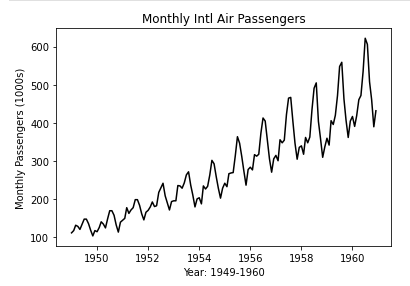

# Time Series Analysis - Introduction

---
## Introduction

In regression analysis, we use a set of one or more independent variables to predict a dependent variable and quantify the relationship between these variables.

Time series analysis, on the other hand, is a statistical technique used to analyze data that is collected over time. Time series data consists of ordered observations made at different points in time, where the order of observations is important. By using this ordered data alone, we can make predictions for the future.

---
## AirPassenger dataset
For the demonstration of time-series analysis, we'll use the well-known `AirPassengers` dataset, which is saved in the data folder as `AirPassengers.csv`. This dataset is a monthly time series, which gives the monthly totals of international airline passengers (in thousands) from 1949 to 1960.

### Exercise
Open the Jupyter Notebook [06_AirPassengers.ipynb](../notebooks/06_AirPassengers.ipynb) and start with the data exploration.

---
## Decomposition and forecasting

In the next bites, we will look into decomposition and forecasting. Both techniques are used to understand and predict patterns in time series data, which can be applied to various fields.

## Submitting Your Work

**No need to submit just yet, retain this information, perhaps in the notebook you have been using for reference in future challenges**

[Next Challenge](07_time_series_decomposition.md)

<!-- BEGIN GENERATED SECTION DO NOT EDIT -->

---

**How was this resource?**  
[😫](https://airtable.com/shrUJ3t7KLMqVRFKR?prefill_Repository=makersacademy%2Fintro-to-data-analysis&prefill_File=stats_bites02%2Fbites%2F06_timeseries.md&prefill_Sentiment=😫) [😕](https://airtable.com/shrUJ3t7KLMqVRFKR?prefill_Repository=makersacademy%2Fintro-to-data-analysis&prefill_File=stats_bites02%2Fbites%2F06_timeseries.md&prefill_Sentiment=😕) [😐](https://airtable.com/shrUJ3t7KLMqVRFKR?prefill_Repository=makersacademy%2Fintro-to-data-analysis&prefill_File=stats_bites02%2Fbites%2F06_timeseries.md&prefill_Sentiment=😐) [🙂](https://airtable.com/shrUJ3t7KLMqVRFKR?prefill_Repository=makersacademy%2Fintro-to-data-analysis&prefill_File=stats_bites02%2Fbites%2F06_timeseries.md&prefill_Sentiment=🙂) [😀](https://airtable.com/shrUJ3t7KLMqVRFKR?prefill_Repository=makersacademy%2Fintro-to-data-analysis&prefill_File=stats_bites02%2Fbites%2F06_timeseries.md&prefill_Sentiment=😀)  
Click an emoji to tell us.

<!-- END GENERATED SECTION DO NOT EDIT -->
