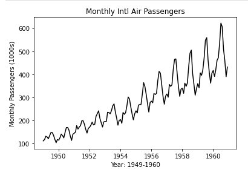
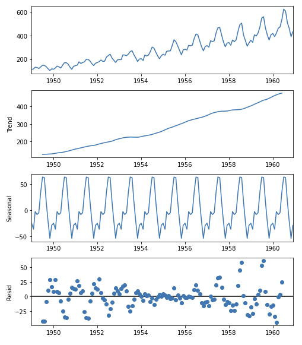

# Time Series - Decomposition
## Learning Objectives
- Understand the concept of time series decomposition and its importance in time series analysis.
- Identify the key components of a time series, including trend, seasonality, and noise.
- Understand the difference between additive and multiplicative decomposition methods and apply them to time series data.
- Use Python and Jupyter notebook to conduct time series decomposition on a given dataset.

## Decomposition of a time series
---

In time series analysis, decomposition refers to the process of breaking down a time series into its constituent parts, typically trend, seasonal, and random components. The objective of decomposition is to better understand the underlying patterns and trends of the time series data.

- **Trend** \
The trend component represents the long-term direction of the series, often influenced by factors such as economic growth, population growth, or technological progress. 

- **Seasonal** \
The seasonal component represents the regular, repeating patterns that occur within the series, often influenced by factors such as weather, holidays, or seasonal events. 

- **Residual** \
The residual or random component represents unpredictable, irregular fluctuations in the series that cannot be explained by the trend or seasonal components.

Once the time series has been decomposed, each component can be analyzed separately and combined to create a forecast for future values of the series. This can be useful for predicting future trends, identifying seasonal patterns, and understanding the overall behaviour of the time series over time.

**Additive decomposition** and **multiplicative decomposition** are two ways to break down the time series:

- Additive decomposition involves adding the trend, seasonality, and noise components together. It assumes that the seasonal patterns are roughly the same over time, regardless of the overall level of the data.

- Multiplicative decomposition involves multiplying the trend, seasonality, and noise components together. It assumes that the seasonal patterns change with the overall level of the data.

In summary, time series decomposition is a way to understand patterns in data that change over time, and we can break it down into its different parts to understand these patterns better. Additive and multiplicative decomposition are two ways to do this, by either adding or multiplying the different parts together.

### Demonstration 
---

For this demonstration, we are using 
- the Jupyter notebook [07_Decomposition.ipynb](../notebooks/07_Decomposition.ipynb) and
- the dataset [airpassengers.csv](../datasets/airpassengers.csv).

**Tasks**
1. Open the Jupyter notebook and familiarise yourself with the code before you run each code cell.

### Exercise

For this exercise, we are using 
- the Jupyter notebook [07_Decomposition_Exercise.ipynb](../notebooks/07_Decomposition_Exercise.ipynb) and
- the dataset [CAC_stockmarkets.csv](../datasets/CAC_stockmarkets.csv).

**Tasks**
1. Import and prepare the dataset `cac_stockmarkets.csv`.
1. Plot the data.
1. Conduct an additive decomposition analysis of the data.
1. Conduct a multiplicative decomposition analysis of the data.

Reveal suggested solution

[07_Decomposition_Solution.ipynb](../notebooks/07_Decomposition_Solution.ipynb)
    

## Submitting Your Work

**No need to submit just yet, retain this information, perhaps in the notebook you have been using for reference in future challenges**

[Next Challenge](08_timeseries_forecasting_with_ARIMA.md)

<!-- BEGIN GENERATED SECTION DO NOT EDIT -->

---

**How was this resource?**  
[😫](https://airtable.com/shrUJ3t7KLMqVRFKR?prefill_Repository=makersacademy%2Fintro-to-data-analysis&prefill_File=stats_bites02%2Fbites%2F07_time_series_decomposition.md&prefill_Sentiment=😫) [😕](https://airtable.com/shrUJ3t7KLMqVRFKR?prefill_Repository=makersacademy%2Fintro-to-data-analysis&prefill_File=stats_bites02%2Fbites%2F07_time_series_decomposition.md&prefill_Sentiment=😕) [😐](https://airtable.com/shrUJ3t7KLMqVRFKR?prefill_Repository=makersacademy%2Fintro-to-data-analysis&prefill_File=stats_bites02%2Fbites%2F07_time_series_decomposition.md&prefill_Sentiment=😐) [🙂](https://airtable.com/shrUJ3t7KLMqVRFKR?prefill_Repository=makersacademy%2Fintro-to-data-analysis&prefill_File=stats_bites02%2Fbites%2F07_time_series_decomposition.md&prefill_Sentiment=🙂) [😀](https://airtable.com/shrUJ3t7KLMqVRFKR?prefill_Repository=makersacademy%2Fintro-to-data-analysis&prefill_File=stats_bites02%2Fbites%2F07_time_series_decomposition.md&prefill_Sentiment=😀)  
Click an emoji to tell us.

<!-- END GENERATED SECTION DO NOT EDIT -->
