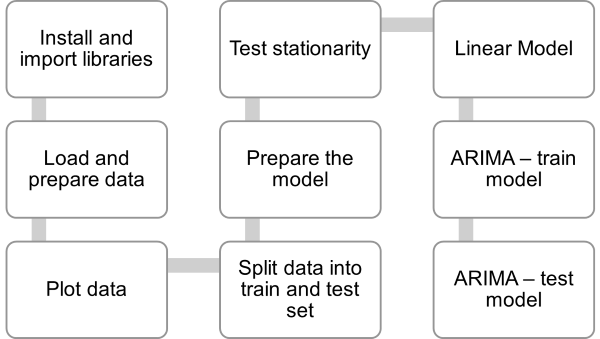
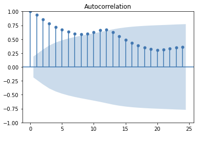
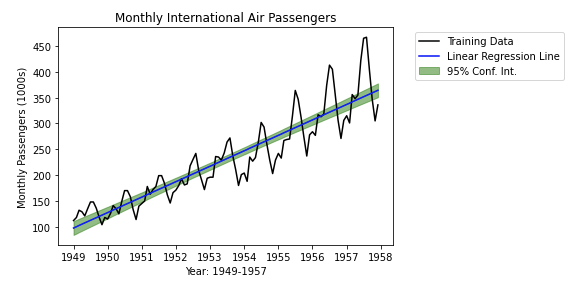
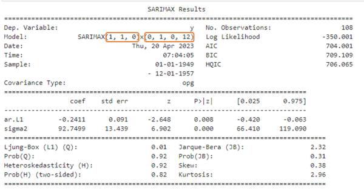
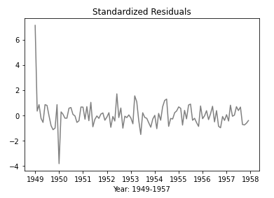
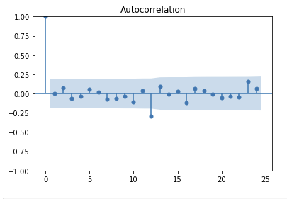
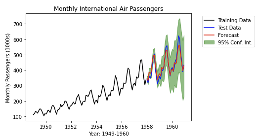
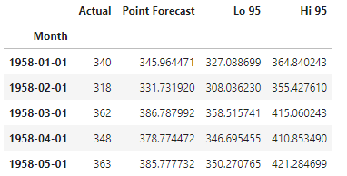

# Time series - forecasting with ARIMA
## Learning Objectives
---
- Understand ARIMA modeling as a method for time series forecasting 
- Apply ARIMA modeling to datasets like AirPassengers to make predictions 
- Utilise ACF and correlogram plots for evaluation.
- Use auto_arima to find optimal values for parameters in ARIMA.
- Evaluate ARIMA model 

## Introduction
---
While decomposition is a great way to visualise a general pattern of what is happening, we need something more sophisticated to make predictions.

**ARIMA** is a commonly used method for analysing temporal data, which involves predicting future values by looking at past values. 
The acronym ARIMA stands for **Autoregressive Integrated Moving Average** Model, and each component of the model has a specific meaning:
- **AR** - autoregressive component predicts future values based on previous or lagged values. 
- **I** - integrated component involves replacing absolute values in the data with differences between those values. 
- **MA** - moving average component involves using linear combinations of current and previous values to predict future values. 

It's important to note that this is not the same as a standard moving average, which is used for smoothing time series data. ARIMA has various variations, such as ARMA, which doesn't have the "I" component, and SARIMA, which includes seasonal components. These methods allow us to look back and use historical data to make predictions about the future.

### Exercise
For this ARIMA forecasting exercise, we will be using 
- the Jupyter notebook [ARIMA.ipynb](../notebooks/ARIMA.ipynb) and
- the dataset [airpassengers.csv](../datasets/airpassengers.csv).

**Tasks**
- While you work through this chapter here, follow along in the Jupyter notebook. 
- Before running a cell, try to anticipate what the code will do.

### Steps
---

## Install and import libraries
---

This exercise requires the pdarima library, which can be installed with Python's pip command. This command only needs to be done once per machine.

_pip is the package installer for Python. It is a tool that allows you to easily download, install, and manage Python packages and their dependencies._

## Load and prepare data
---
`parse_dates=['Month']`: This argument specifies that the 'Month' column in the CSV file should be parsed as a date.

`index_col=['Month']`: This argument specifies that the 'Month' column should be used as the index column of the DataFrame. Setting the index to the 'Month' column is useful when working with time-series data because it allows you to easily slice and group the data by time intervals. For example, you could easily resample the data to monthly or yearly intervals or select a subset of data for a specific date range using slicing operations.

## Split data into train and test set
---
Randomly in regression analysis, but not here as the data is ordered.

The `.loc` method is used to perform the selection based on the condition. This method allows you to select rows and columns of a DataFrame by label or condition.

## Prepare the model
---

### Test stationarity
ARIMA requires non-stationary data. That is, ARIMA needs data where the mean, the variance, and/or the covariance vary over time. Non-stationary data shows significant correlations when lagged. 

A "correlogram" graph (or ACF plot) shows the degree of correlation at different values of lag. Ideally, none of the lag values will fall in the range of nonsignificant correlations.

_A correlogram is a plot that shows the autocorrelations between a time series and its lagged values. Autocorrelation is a measure of the similarity between a time series and a delayed copy of itself. A high autocorrelation indicates that the time series is highly correlated with its past values._

### Linear model
Steps:
- Build the model, fit the data and show the summary for the model.
- Extract the fitted values
- Extract the 95% prediction interval
- Calculate the **confidence intervals** for the predicted values. 
These confidence intervals can be used to assess the uncertainty around the predicted values and to make decisions based on the level of risk that is acceptable.
- Plot the time series with linear regression line and corresponding 95% confidence interval

## ARIMA: Train model
---
The ARIMA model has three parameters: p, d, and q. 
- **p** describes the number of past observations that are used to predict the next observation. 
- **d** describes the number of times that the data needs to be "differenced" to make it easier to predict. 
- **q** describes the number of past error terms that are used to predict the next observation.

Finding the optimal values of these parameters is important because it can greatly affect the accuracy of your predictions. If you use the wrong values, your predictions might be way off. It's like trying to predict the weather without looking at the forecast - you might get lucky, but you'll probably be wrong a lot of the time.

### auto_arima
Find the best ARIMA order using the auto_arima function in the pmdarima package. Note that the auto_arima function assumes that the time series is non-seasonal by default (i.e. the seasonal period "m" is set equal to 1 by default). In what follows, we set "m" equal to 12 to ensure that the selected optimal model takes into account the annual seasonality observed in the time series (one cycle every 12 months).

`auto_arima_model = auto_arima(train, m=12, with_intercept=False, suppress_warnings=True)
print(auto_arima_model.summary())`

The `auto_arima` function suggests `ARIMA(1,1,0)(0,1,0,12)`.   

First set of numbers is for the **basic, non-seasonal** model    
&nbsp;  1 &nbsp;&nbsp;&nbsp;    # p: Auto-regressive (AR) order   
&nbsp;  1 &nbsp;&nbsp;&nbsp;    # d: Integrate (I), or degree of differencing   
&nbsp;  0 &nbsp;&nbsp;&nbsp;    # q: Moving average (MA) order  

Second set of numbers is for **seasonality**    
&nbsp;  0 &nbsp;&nbsp;&nbsp;    # P: Auto-regressive (AR) order    
&nbsp;  1 &nbsp;&nbsp;&nbsp;    # D: Integrate (I), or degree of differencing    
&nbsp;  0 &nbsp;&nbsp;&nbsp;    # Q: Moving average (MA) order   
&nbsp;  12 &nbsp;  # M: Model period or seasonality   

>We will need these numbers later to test our model!

 

### Residuals
The residual is the difference between the predicted value and the actual observed value at that time point. The residual represents the unexplained variation in the data that is not accounted for by the model.

The residuals can be used to assess how well the model fits the data. A good model should have residuals that are randomly scattered around zero, indicating that the model is capturing most of the patterns in the data. If the residuals have a systematic pattern, it suggests that the model is not capturing all the important features of the data.

### Autocorrelation function (ACF)
The residuals can be used to check for autocorrelation, which occurs when the residuals are correlated with each other over time. If autocorrelation is present, it suggests that the model is not capturing all the important patterns in the data and that additional factors may need to be considered.

## ARIMA - Test the model
---
To test the model, we fit it to the training data and run the ARIMA function with the numbers suggested earlier by `auto_arima`.

`ARIMA(order=(1, 1, 0), scoring_args={}, seasonal_order=(0, 1, 0, 12),` \
`      suppress_warnings=True, with_intercept=False)`
      
Next, we use the model to predict against the intervals. That is, apply the model to the testing dataset.
We extract the timeseries of model predictions and the 95% prediction interval.

The most rewarding part of an ARIMA model like this is the graph of the predictions.

We can also create a DataFrame with the observed values for the testing dataset and add the predictions from the ARIMA model plus the low and high boundaries for the 95% confidence intervals.

[Next Challenge](09_clustering.md)

<!-- BEGIN GENERATED SECTION DO NOT EDIT -->

---

**How was this resource?**  
[😫](https://airtable.com/shrUJ3t7KLMqVRFKR?prefill_Repository=makersacademy%2Fintro-to-data-analysis&prefill_File=stats_bites02%2Fbites%2F08_timeseries_forecasting_with_ARIMA.md&prefill_Sentiment=😫) [😕](https://airtable.com/shrUJ3t7KLMqVRFKR?prefill_Repository=makersacademy%2Fintro-to-data-analysis&prefill_File=stats_bites02%2Fbites%2F08_timeseries_forecasting_with_ARIMA.md&prefill_Sentiment=😕) [😐](https://airtable.com/shrUJ3t7KLMqVRFKR?prefill_Repository=makersacademy%2Fintro-to-data-analysis&prefill_File=stats_bites02%2Fbites%2F08_timeseries_forecasting_with_ARIMA.md&prefill_Sentiment=😐) [🙂](https://airtable.com/shrUJ3t7KLMqVRFKR?prefill_Repository=makersacademy%2Fintro-to-data-analysis&prefill_File=stats_bites02%2Fbites%2F08_timeseries_forecasting_with_ARIMA.md&prefill_Sentiment=🙂) [😀](https://airtable.com/shrUJ3t7KLMqVRFKR?prefill_Repository=makersacademy%2Fintro-to-data-analysis&prefill_File=stats_bites02%2Fbites%2F08_timeseries_forecasting_with_ARIMA.md&prefill_Sentiment=😀)  
Click an emoji to tell us.

<!-- END GENERATED SECTION DO NOT EDIT -->
